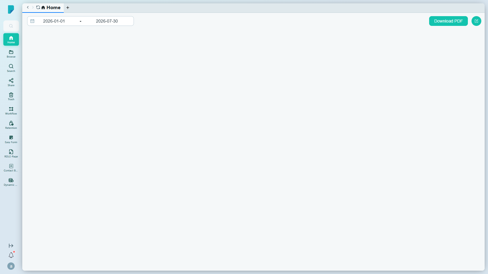
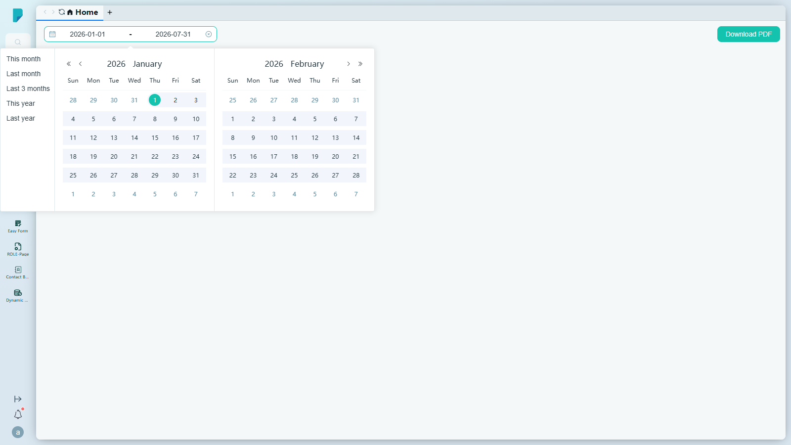

# Home

**Menu path:** Client → Home

## 此畫面的用途
每位用戶登入後都會到達這個個人儀表板——它是每日工作的單一起點。它把個人活動與檔案概覽匯集於一處，並提供匯出工具，可將目前檢視匯出作報告分享。

## 工具列與操作
- **PERSONAL tab**（個人分頁）——此畫面顯示的儀表板分區。**Home** 儀表板顯示於其下。
- **Start date / End date**（開始／結束日期）——儀表板內容的日期範圍篩選。點擊其中一個欄位會開啟雙月曆選擇器，並附一鍵快捷選項：
  - This month（本月）
  - Last month（上月）
  - Last 3 months（過去三個月）
  - This year（本年）
  - Last year（去年）
  - 本站點的預設範圍為年初至今（2026-01-01 至 2026-07-31）。
- **Download PDF**——將目前儀表板檢視匯出為 PDF 檔案，作報告或分享之用。在此測試站點上，點擊後沒有可見的確認提示；下載會直接開始。

## 列表與欄位
- 此畫面沒有列表或表格——它是儀表板檢視。

## 對話框與面板
### 日期範圍選擇器

- 左右並排的雙月曆（附上一個月／下一個月及年份導航箭嘴），用於選取開始與結束日期。
- 常用範圍的快捷按鈕（列於上文）可一鍵填入兩個日期。

## 測試站點備註
- 在此測試站點上，儀表板主體並未渲染任何圖表或小工具——只顯示儀表板標頭（日期範圍 + Download PDF）。

## 誰會使用
每位 DocPal 用戶——這是登入後的第一個畫面。
