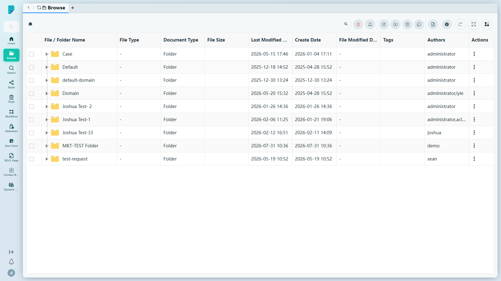
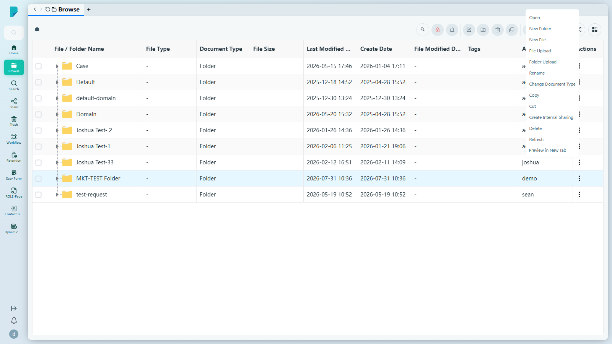
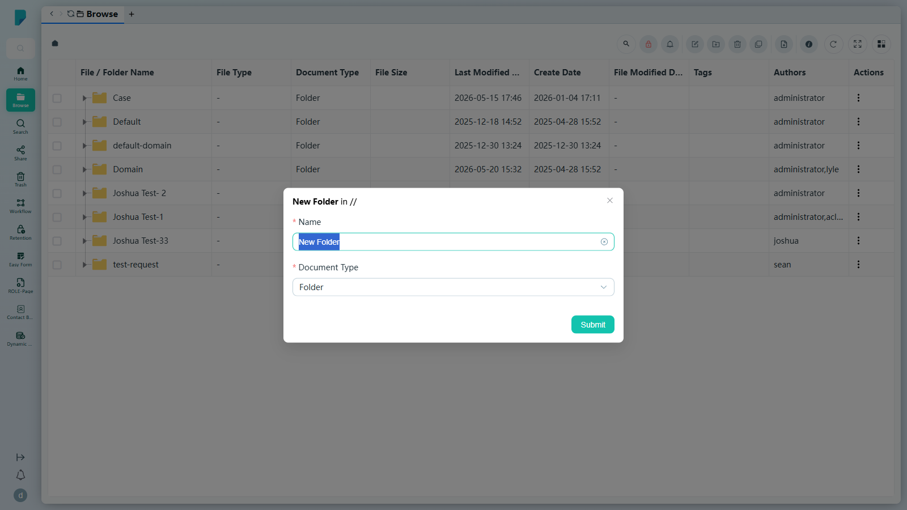
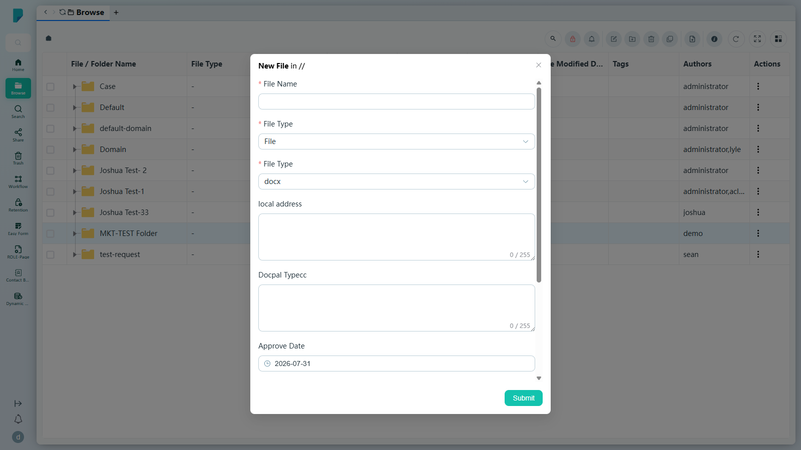
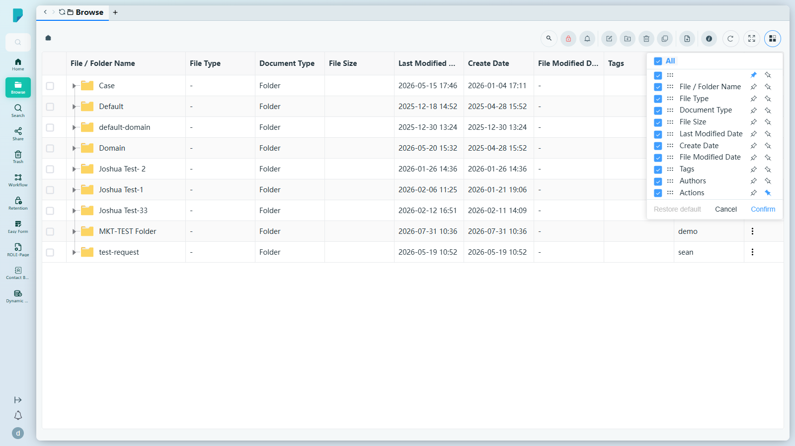
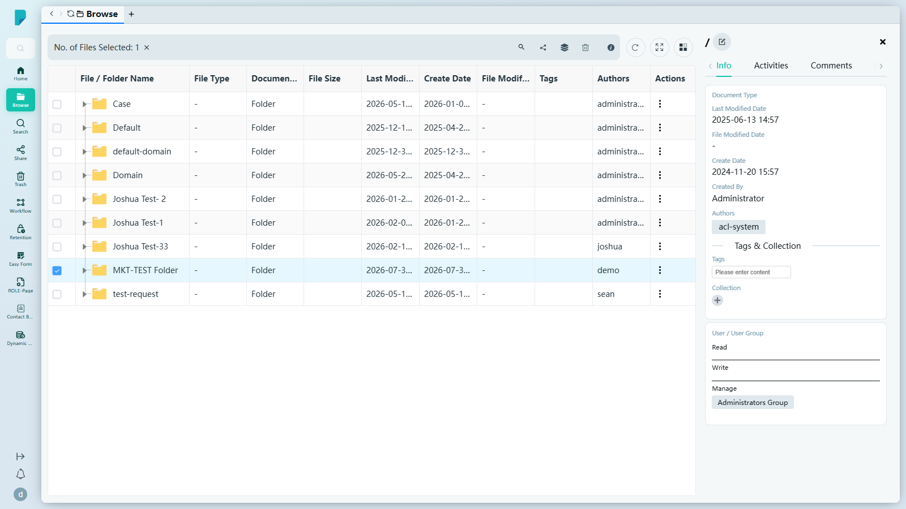

# Browse

**Menu path:** Client → Browse → Browse

## 此畫面的用途
以熟悉的資料夾與檔案檢視呈現整個檔案庫，讓尋找文件就像翻閱整理得井井有條的檔案櫃。建立資料夾和檔案、上傳內容、分享、加標籤及管理權限——全部可在同一個網格內完成。根層級顯示頂層資料夾（Case、Default、default-domain、Domain 及團隊資料夾）。

## 工具列與操作

未選取任何項目時（對目前資料夾操作）：

- **Search (magnifier)**（搜尋放大鏡）——展開一個行內的「Search...」輸入框，篩選目前列表；× 圖示可將其收起。
- **Add Hold Policy**——套用保留政策（hold policy）的下拉選單。本站點的選單為空（未設定任何保留政策）。
- **Subscribe**——訂閱目前項目／位置的通知。
- **Edit Details**——編輯目前項目的詳細資料。
- **New File/Folder**（下拉選單）——建立內容：
  - New Folder
  - New File
  - File Upload
  - Folder Upload
- **Delete**——刪除項目。
- **Copy Path**——將目前資料夾路徑複製到剪貼簿。
- **Upload Request**——提出上傳請求（向外部人士）。
- **Info**——開啟詳細資料側邊面板（見下文）。
- **Refresh**——重新載入列表。
- **Full screen**——切換網格全螢幕顯示。
- **Column settings**——自訂網格（見下文）。

勾選一或多列後，工具列會切換至選取模式，顯示 **「No. of Files Selected: N」**（已選取檔案數目）及一個可清除選取的 ×，另加：

- **Search**、**Delete**、**Info**、**Refresh**、**Full screen**、**Column settings**（同上）
- **Share**——將所選項目加入 **Share Queue**（分享佇列，底部中央顯示一個寫著「Share Queue N」的膠囊標籤，附 **Share** 按鈕及一個可清除的 ×）。點擊 **Share** 會開啟 Share Queue 分頁：Recipients（輸入電郵地址）、Password、Due Date（預設約 30 日後），以及一個檔案表格（Name、Watermark、Read-Only 切換開關、Last Modified Date、Actions），並附 **Confirm** 按鈕。
- **Add To Collection**（圖層圖示）——開啟 Add To Collection 對話框（見下文）。

## 列表與欄位

- 欄位：**File / Folder Name**（列核取方塊 + 資料夾的展開箭嘴）、**File Type**、**Document Type**、**File Size**、**Last Modified Date**、**Create Date**、**File Modified Date**、**Tags**、**Authors**、**Actions**（⋮ 選單）。
- 每列的 **Actions (⋮)** 內容選單：
  - Open
  - New Folder
  - New File
  - File Upload
  - Folder Upload
  - Rename
  - Change Document Type
  - Copy
  - Cut
  - Create Internal Sharing
  - Delete
  - Refresh
  - Preview in New Tab

## 對話框與面板

### New Folder

- 標題顯示目標位置（在根層級時為「New Folder in //」）。
- **Name***——文字欄位，預填「New Folder」。
- **Document Type***——下拉選單，預設「Folder」。本站點的選項：Case、Contract、Contract Attachment、ContractFolder、Customer、Folder、Pre-Sales、Prospect、Prospect Profile、Prospects、steve_test_2。
- **Submit**——建立資料夾。（已測試：建立「MKT-TEST Folder」，隨即出現在列表中。）

### New File

- **File Name***——文字欄位。
- **File Type***——文件類型下拉選單（已設定的類型列表很長；預設「File」）。
- **File Type***——檔案副檔名下拉選單：xlsx、docx（預設）、ppt。
- **Metadata fields**（元數據欄位）——會根據所選文件類型顯示額外欄位。本站點類型「File」的欄位：**local address**（文字，最多 255 字元）、**Docpal Typecc**（文字，最多 255 字元）、**Approve Date**（日期選擇器，預設為今天）、**Country**（文字，最多 255 字元）、**Approver**（文字，最多 255 字元）。每個文字欄位均顯示即時字元計數器（「0 / 255」）。
- **Submit**——建立檔案（測試期間未提交）。

### Add To Collection
- **Search a collection or Create new**——選取現有集合，或輸入新名稱。
- **Submit**——加入所選項目。

### Column settings

- **All** 主控核取方塊，加上每個欄位各自的顯示／隱藏核取方塊。
- 每個欄位可設 **Freeze left / Freeze right / Unfreeze**（向左凍結／向右凍結／取消凍結）。
- **Restore default**（未改動時停用）、**Cancel**、**Confirm**。

### Info 側邊面板

以右側抽屜形式為目前位置／所選項目開啟，設有四個分頁：

- **Info**——Document Type、Last Modified Date、File Modified Date、Create Date、Created By、Authors；一個 **Tags & Collection** 分區（Tags 輸入框、Collection 新增按鈕）；以及按 Read / Write / Manage 分組的 **User / User Group** 權限（例如 Administrators Group 歸於 Manage）。頂部的鉛筆圖示可編輯詳細資料。
- **Activities**——項目操作紀錄的審計訊息流（例如「File Management — User administrator preview document [/] — 2026-07-31 09:47」），附 **loadMore** 按鈕。
- **Comments**——留言輸入框，附 **Send** 按鈕。
- **Related**——相關項目（本站點根層級顯示「No Data」）。

## 測試站點備註
- 已建立測試數據：Browse 根層級的資料夾 **「MKT-TEST Folder」**（可見於主要截圖，作者為「demo」）。
- 本文件於 sit-v3 測試站點上編寫；上述所有對話框均已在該站點開啟並驗證。

## 誰會使用
日常處理檔案的最終用戶及文件管理人員。
