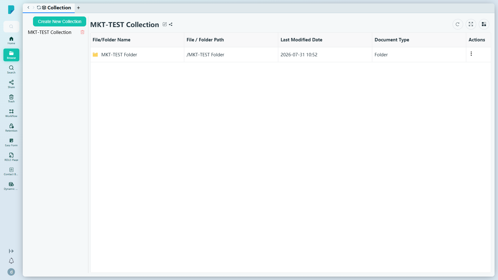
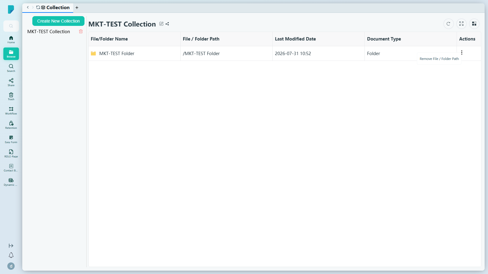
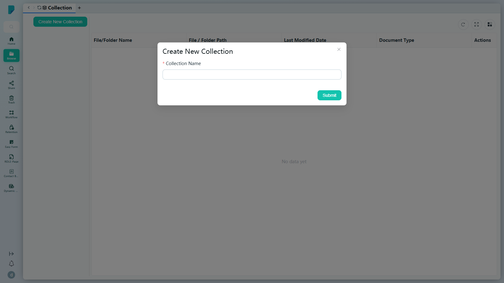

# Collection

**Menu path:** Client → Browse → Collection

## 此畫面的用途
把相關文件分組成集合（Collection），讓專案檔案、個案檔案或工作組合無論原件放在哪裡都能聚在一起。在左邊選取一個集合，即可在右邊看到當中所有項目——每個項目都保留指向其真實位置的連結。此列表顯示你自己的集合。

## 工具列與操作
- **Create New Collection**——開啟建立對話框（見下文）。
- **Collapse icon**（箭嘴圖示，位於按鈕旁）——摺疊／展開集合列表面板。
- **Collection list**（左側面板）——按名稱列出你的集合；點擊其中一個以載入其內容。每個集合都有一個紅色**垃圾桶圖示**，用於刪除該集合。
- 已開啟集合標題旁：
  - **Edit Collection Info**（鉛筆圖示）——編輯集合的詳細資料。
  - **Add to Share Queue**（分享圖示）——將整個集合加入 Share Queue 作分享。
- **Refresh**——重新載入內容表格。
- **Full screen**——切換表格全螢幕顯示。
- **Column settings**——顯示／隱藏表格欄位。

項目從 Browse 加入集合：選取檔案／資料夾，然後使用 **Add To Collection**（見 [[02-browse]]）。Add To Collection 選擇器會列出現有集合（本站點：12dsd、2、MKT-TEST Collection、Test-1、Ups），亦可讓你輸入新名稱。

## 列表與欄位
- 欄位：**File/Folder Name**、**File / Folder Path**（項目的真實位置，例如 `/MKT-TEST Folder`）、**Last Modified Date**、**Document Type**、**Actions**。
- 內容列的 **Actions (⋮)** 只有一個項目：**Remove File / Folder Path**——將項目從集合中移除（原始檔案仍留在其資料夾內）。

## 對話框與面板
### Create New Collection

- **Collection Name***——文字欄位。
- **Submit**——建立集合；集合隨即出現在左邊列表。（已測試：建立「MKT-TEST Collection」。）

## 測試站點備註
- 已建立測試數據：集合 **「MKT-TEST Collection」**，並已將 **「MKT-TEST Folder」** 加入其中（可見於主要截圖）。
- 左邊列表只顯示登入用戶（demo）建立的集合——其他用戶建立的集合（12dsd、2、Test-1、Ups）會出現在 Add To Collection 選擇器中，但不會出現在此列表。

## 誰會使用
需要把分散在不同資料夾的文件匯集成單一工作組合的用戶。
