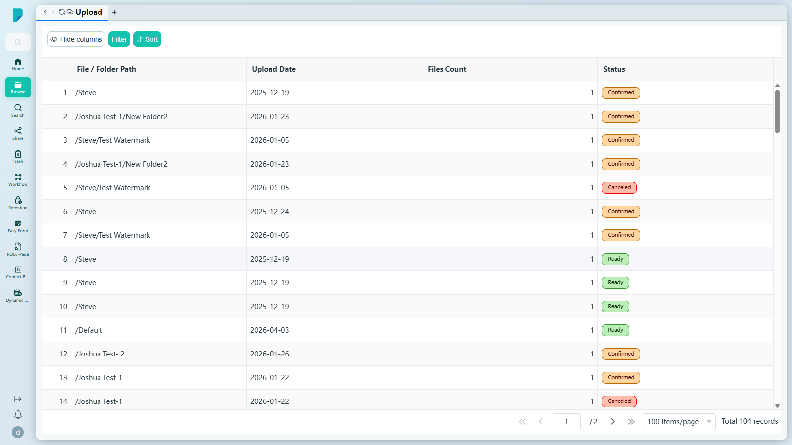
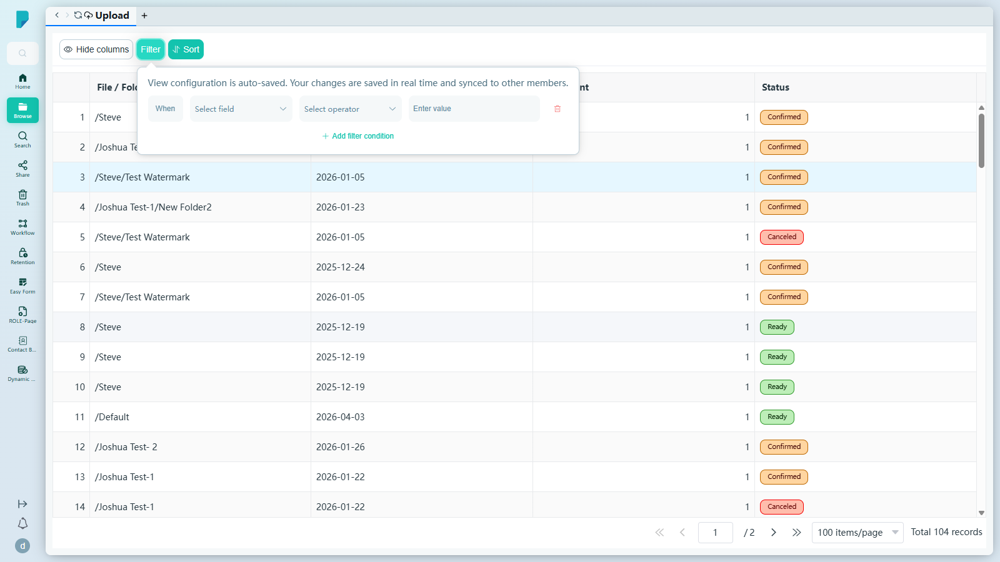
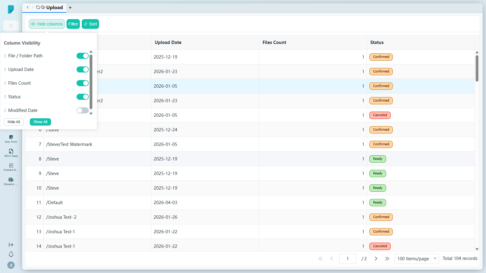

# Upload

**Menu path:** Client → Browse → Upload

## 此畫面的用途
以可追蹤的檢視呈現各個上傳批次——每個上傳工作都會記錄於此，包括目標路徑、日期、檔案數目及狀態，讓用戶準確掌握甚麼內容在何時進入了檔案庫。

## 工具列與操作
- **Hide columns**（隱藏欄位）——「Column Visibility」彈出面板：拖曳手柄（⋮⋮）可重新排列欄位次序，每個欄位設有開關切換，並附 **Hide All** / **Show All** 按鈕。其中包括一個預設隱藏的 **Modified Date** 欄位。
- **Filter**（篩選）——建立篩選規則的彈出面板（「View configuration is auto-saved. Your changes are saved in real time and synced to other members.」，即檢視設定會自動儲存、實時保存並同步給其他成員）：
  - **+ Add filter condition** 新增一列規則：**When** + **Select field** + **Select operator** + **Enter value**，並附垃圾桶圖示以移除該規則。
  - 可篩選欄位：File / Folder Path、Upload Date、Files Count、Status、Modified Date。
- **Sort**（排序）——建立排序規則的彈出面板（「View settings are saved automatically...」，即檢視設定會自動儲存……）：
  - **+ Add sort rule** 新增一列：欄位下拉選單（同樣五個欄位），加上 **A → Z** / **Z → A** 方向按鈕及垃圾桶圖示。

## 列表與欄位
- 列號加上以下欄位：**File / Folder Path**（批次上傳到的位置，例如 `/Steve/Test Watermark`）、**Upload Date**、**Files Count**、**Status**。
- 本站點所見的狀態值：**Confirmed**、**Canceled**、**Ready**。
- 此處各列均為唯讀——點擊某列不會開啟任何詳細檢視。
- 分頁列：**Jump up page**（第一頁）、**Previous page**（上一頁）、頁碼輸入框（例如「1 / 2」）、**Next page**（下一頁）、**Jump down page**（最後一頁）、每頁筆數選擇器（**10 / 15 / 20 / 50 / 100 items/page**，預設 100），以及 **Total N records** 總筆數計數器（本站點為 104 筆）。

## 測試站點備註
- 列表在 sit-v3 測試站點上載入及分頁均正常（104 個上傳批次）。未發現錯誤。

## 誰會使用
任何需要把文件放入 DocPal 並追蹤已上傳內容的用戶。
