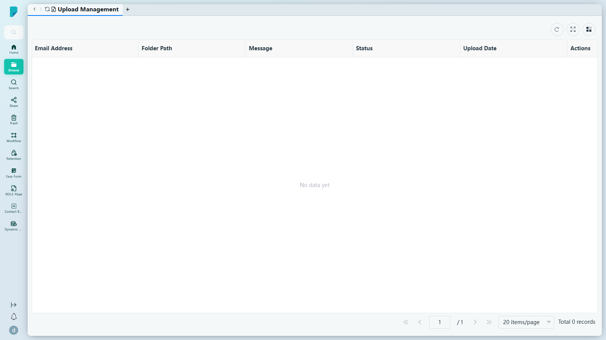
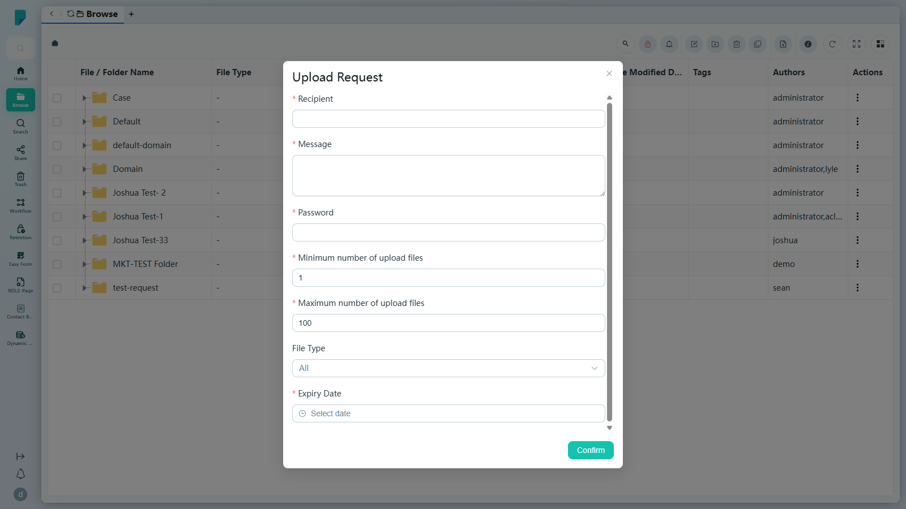

# Upload Management

**Menu path:** Client → Browse → Upload Management

## 此畫面的用途
你向外部人士發出的每個上傳請求，都會在這個列表中一一追蹤——邀請了誰、檔案應上傳到哪裡，以及上傳是否已經完成。它讓外部提供的檔案清晰可見、易於掌控，而無需為外部人士開設帳戶。

## 工具列與操作
- **Refresh**——重新載入列表。
- **Full screen**——切換表格全螢幕顯示。
- **Column settings**——顯示／隱藏表格欄位。

新的上傳請求從 **Browse** 頁面的工具列建立（**Upload Request** 圖示——見 [[02-browse]]）。

## 列表與欄位
- 欄位：**Email Address**（收件人）、**Folder Path**（其檔案的上傳目的地）、**Message**、**Status**、**Upload Date**、**Actions**。
- 分頁列：**Jump up page**（第一頁）、**Previous page**（上一頁）、頁碼輸入框、**Next page**（下一頁）、**Jump down page**（最後一頁）、每頁筆數選擇器（預設 **20 items/page**）、**Total N records** 總筆數計數器。
- 在此測試站點上，列表為空（「No data yet」，0 筆記錄）——此用戶尚未發出任何上傳請求。

## 對話框與面板
### Upload Request（從 Browse → Upload Request 圖示開啟）

- **Recipient***——外部人士的電郵地址。
- **Message***——附於邀請中的多行訊息。
- **Password***——收件人開啟上傳連結所需的密碼。
- **Minimum number of upload files***——上傳檔案數目下限，預設 1。
- **Maximum number of upload files***——上傳檔案數目上限，預設 100。
- **File Type**——允許的檔案類型，可多選；選項：.xls、.xlsx、.doc、.docx、.pptx、.ppt、.mp3、.mp4（預設「All」）。
- **Expiry Date***——日期選擇器；上傳連結在此日期後失效。
- **Confirm**——發出請求。測試期間未提交（因會真實發出邀請電郵）；你確認的請求會出現在本頁的列表中。

## 測試站點備註
- 頁面在 sit-v3 上載入正常；未發現錯誤。

## 誰會使用
需要向客戶、供應商或合作夥伴收集文件，並希望清晰記錄每個未完成請求的用戶。
