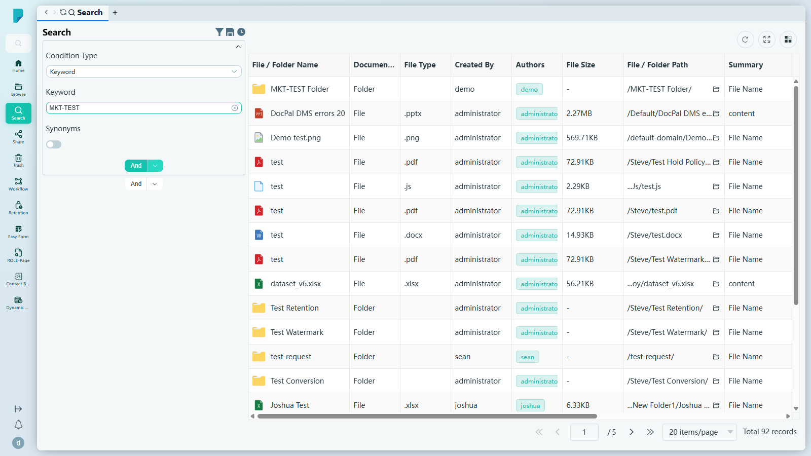
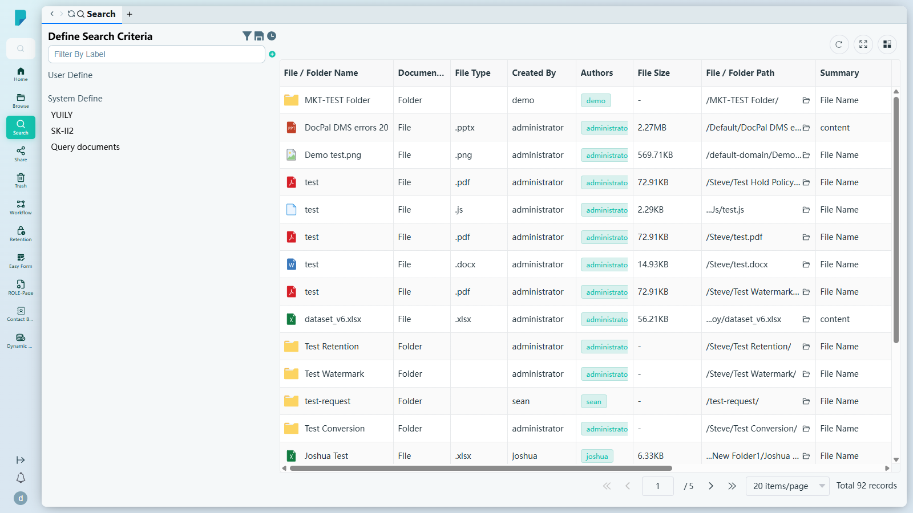
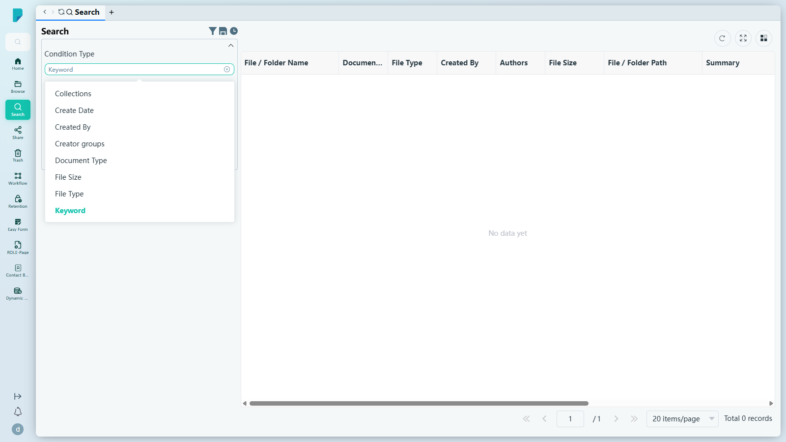
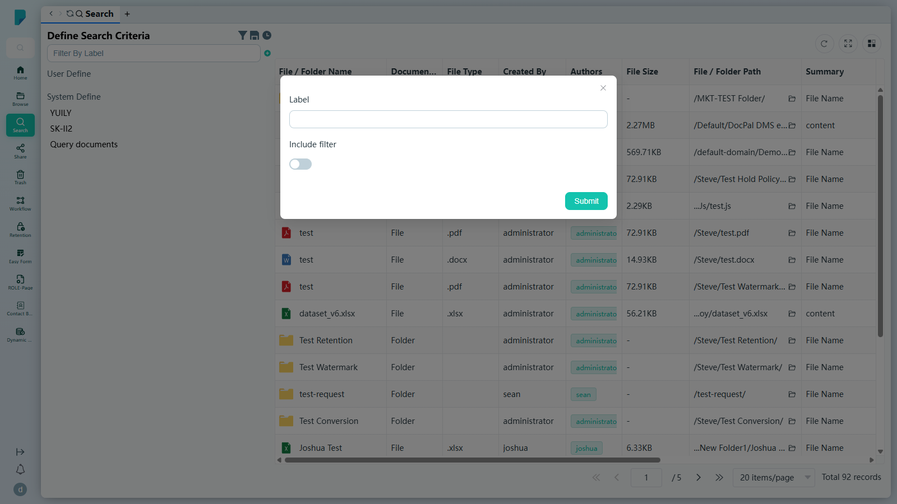
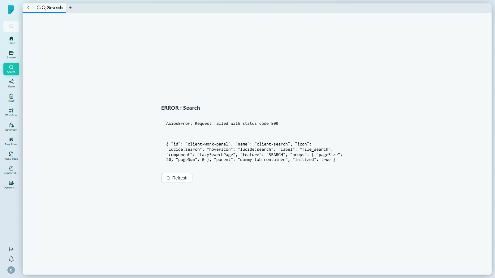

# Search

**選單路徑：** Client → Search

## 此畫面的用途
橫跨整個文件庫的進階搜尋——透過組合精確的搜尋條件找出任何文件，毋須逐層翻查資料夾。你可以儲存常用的搜尋，日後一按即可重新執行。

## 工具列與操作
- **Define Search Criteria (funnel icon)** — 開關左側的已儲存搜尋面板：
  - **Filter By Label** — 輸入文字以篩選已儲存的搜尋；旁邊的 **+** 按鈕可將目前的搜尋儲存為新條件（見下文對話框）。
  - **User Define** — 你自己儲存的搜尋。
  - **System Define** — 系統隨附的預設搜尋（在此測試網站為：YUILY、SK-II2、Query documents）。
- **Save (floppy icon)** — 儲存目前的搜尋。
- **Recent (clock icon)** — 最近執行過的搜尋。
- **Refresh** — 重新載入結果。
- **Full screen** — 將結果表格切換為全螢幕。
- **Column settings** — 顯示／隱藏結果欄位。

## 建立查詢
- **Condition Type** — 下拉選單提供 12 種條件類型：
  - Author groups、Authors、Collections、Create Date、Created By、Creator groups、Document Type、File Size、File Type、Keyword、Last Modified Date、Metadata
- **Keyword** — 要搜尋的關鍵字。按 **Enter** 即執行搜尋（介面沒有獨立的 Search 按鈕）。
- **Synonyms** — 開關；開啟後亦會同時搜尋相關詞彙。
- **And / Or** — 分割按鈕，以 And 或 Or 邏輯組合多個條件。

## 列表與欄位
- 結果欄位：**File / Folder Name**（附檔案類型圖示）、**Document Type**、**File Type**（副檔名）、**Created By**、**Authors**、**File Size**、**File / Folder Path**（附複製路徑圖示）、**Summary**（顯示符合的內容，例如 "File Name" 或 "content"）、**Create Date**、**Last Modified Date**、**Tags**。
- 分頁列：**Jump up page**（第一頁）、**Previous page**、頁碼輸入框（例如 "1 / 5"）、**Next page**、**Jump down page**（最後一頁）、每頁筆數選擇器（預設 **20 items/page**）、**Total N records** 計數器。
- 此測試網站的實際範例：以關鍵字 `MKT-TEST` 搜尋 → 共 92 筆記錄，首個結果為 MKT-TEST Folder。

## 對話框與面板
### Save search criterion（由 Define Search Criteria → + 開啟）

- **Label** — 已儲存搜尋的名稱。
- **Include filter** — 開關；一併儲存目前的篩選條件。
- **Submit** — 將搜尋儲存至 User Define。

## 測試網站的備註
- **測試網站的已知問題：** 儲存自訂搜尋條件（Define Search Criteria → + → Submit）會因後端 500 錯誤而失敗，並令 Search 分頁崩潰，其後顯示「ERROR : Search — AxiosError: Request failed with status code 500」及 Refresh 按鈕（見 `client-07-search-save-500-error.png`）。搜尋功能本身運作正常。

## 誰會使用
所有用戶——由偶爾搜尋文件的用戶，到建立精確多條件查詢的進階用戶。
