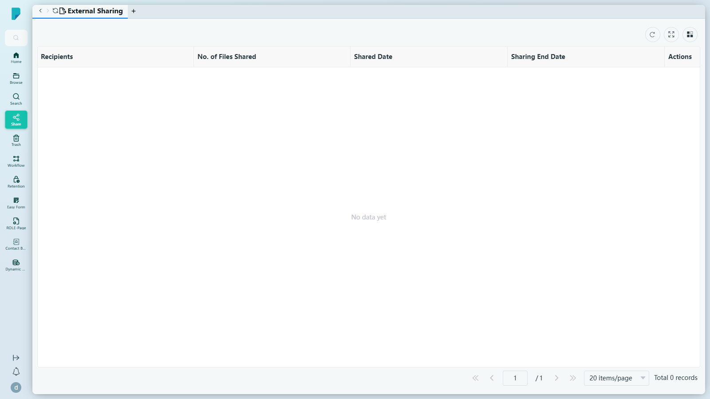
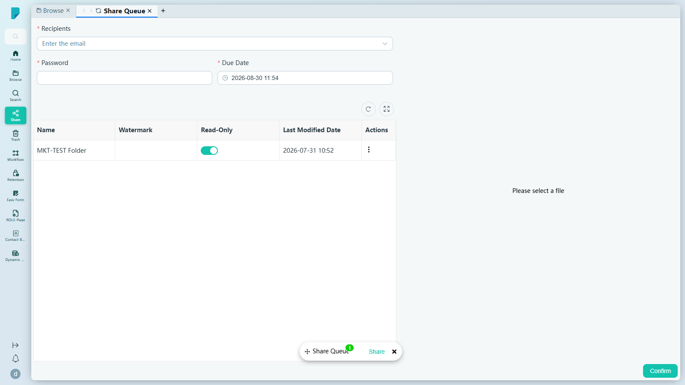

# External Sharing

**選單路徑：** Client → Share → External Sharing

## 此畫面的用途
你分享給 DocPal 以外人士的所有連結都集中在此追蹤——誰收到連結、包含多少檔案、何時到期——讓外部存取一目了然，並可隨時撤銷。

## 工具列與操作
- **Refresh** — 重新載入列表。
- **Full screen** — 將表格切換為全螢幕。
- **Column settings** — 顯示／隱藏表格欄位。

新的外部分享由 **Browse** 建立：選取檔案／資料夾，按 **Share** 將它們加入 **Share Queue**，然後在 Share Queue 的浮標按鈕上按 **Share** 開啟分享表格（見下文）。

## 列表與欄位
- 欄位：**Recipients**、**No. of Files Shared**、**Shared Date**、**Sharing End Date**、**Actions**。
- 分頁列：**Jump up page**（第一頁）、**Previous page**、頁碼輸入框、**Next page**、**Jump down page**（最後一頁）、每頁筆數選擇器（預設 **20 items/page**）、**Total N records** 計數器。
- 此測試網站的列表為空（「No data yet」，0 筆記錄）——此用戶沒有任何外發的外部分享。

## 對話框與面板
### Share Queue — 外部分享表格（由 Browse → Share 開啟）

- **Recipients*** — 一個或多個電郵地址（「Enter the email」）。
- **Password*** — 收件人開啟分享連結所需的密碼。
- **Due Date*** — 分享的到期日；預設為約 30 日後（例如 2026-08-30）。
- **File table** — 已排入隊列的項目，欄位包括：**Name**、**Watermark**、**Read-Only**（每個項目設有開關，預設開啟）、**Last Modified Date**、**Actions**。
- **Confirm** — 建立分享（測試期間並未提交，以免向真實收件人發送電郵）；已確認的分享會顯示在本頁的列表中。

## 測試網站的備註
- 此頁面及分享表格在 sit-v3 上均正常載入；未發現錯誤。測試期間並未提交任何分享。

## 誰會使用
任何需要與機構以外的客戶、合作夥伴或審閱者分享文件，並需要追蹤哪些分享仍然有效的人士。
