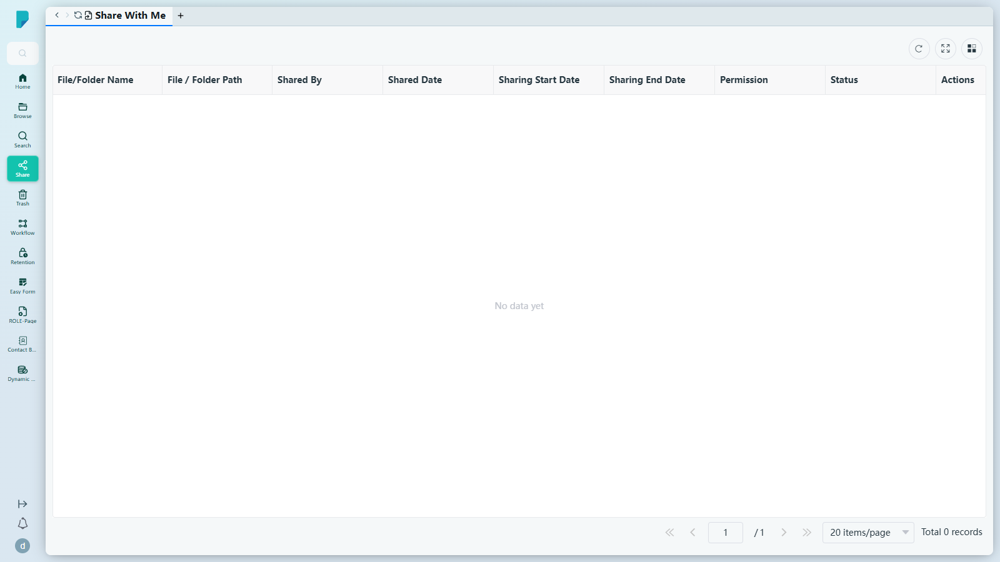

# Share With Me

**選單路徑：** Client → Share → Share With Me

## 此畫面的用途
以收件匣形式列出其他人分享給你的所有項目——內容是甚麼、由誰分享、分享有效期多久，以及你可以對它進行哪些操作。

## 工具列與操作
- **Refresh** — 重新載入列表。
- **Full screen** — 將表格切換為全螢幕。
- **Column settings** — 顯示／隱藏表格欄位。

## 列表與欄位
- 欄位：**File/Folder Name**、**File / Folder Path**、**Shared By**、**Shared Date**、**Sharing Start Date**、**Sharing End Date**、**Permission**、**Status**、**Actions**。
- 分頁列：**Jump up page**（第一頁）、**Previous page**、頁碼輸入框、**Next page**、**Jump down page**（最後一頁）、每頁筆數選擇器（預設 **20 items/page**）、**Total N records** 計數器。
- 此測試網站的列表為空（「No data yet」，0 筆記錄）——沒有任何項目分享給此用戶。

## 測試網站的備註
- 此頁面在 sit-v3 上正常載入；未發現錯誤。

## 誰會使用
所有用戶——這裡是接收同事或外部人士交付文件的集中地。
