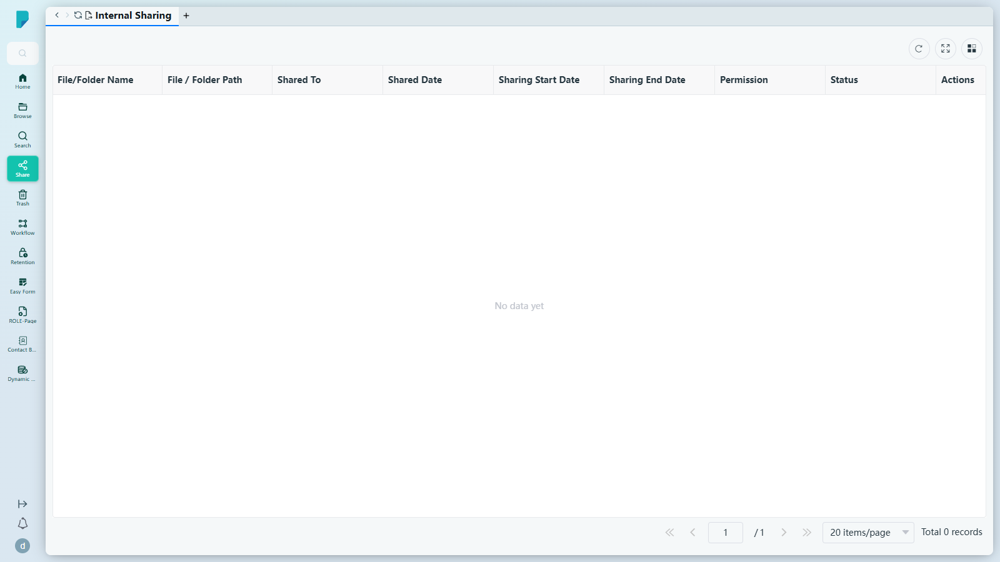
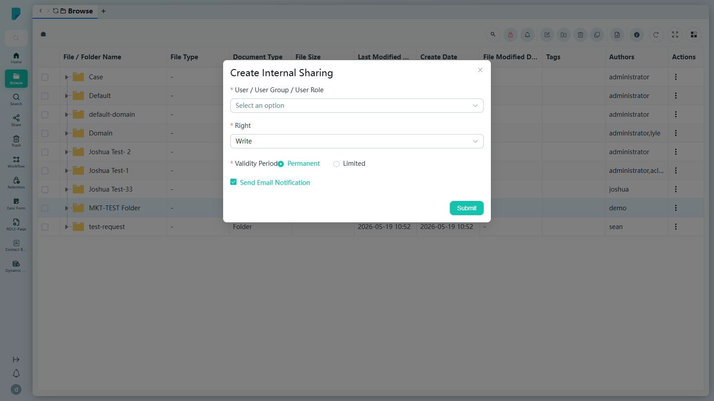

# Internal Sharing

**選單路徑：** Client → Share → Internal Sharing

## 此畫面的用途
清晰記錄你在 DocPal 內部分享給同事的所有項目——誰收到、對方可以進行哪些操作，以及分享的有效期。

## 工具列與操作
- **Refresh** — 重新載入列表。
- **Full screen** — 將表格切換為全螢幕。
- **Column settings** — 顯示／隱藏表格欄位。

新的內部分享由 **Browse** 建立：在列的 ⋮ 選單中選擇 **Create Internal Sharing**（見下文對話框）。

## 列表與欄位
- 欄位：**File/Folder Name**、**File / Folder Path**、**Shared To**、**Shared Date**、**Sharing Start Date**、**Sharing End Date**、**Permission**、**Status**、**Actions**。
- 分頁列：**Jump up page**（第一頁）、**Previous page**、頁碼輸入框、**Next page**、**Jump down page**（最後一頁）、每頁筆數選擇器（預設 **20 items/page**）、**Total N records** 計數器。
- 此測試網站的列表為空（「No data yet」，0 筆記錄）——此用戶沒有任何外發的內部分享。

## 對話框與面板
### Create Internal Sharing（由 Browse → 列的 ⋮ 選單開啟）

- **User / User Group / User Role*** — 選擇器，列出各個用戶群組（例如 President's Office、Personal Dept、Finance Dept、Onedrive Team）及個別用戶。
- **Right*** — 權限級別：**Read**、**Write**（預設）、**Manage**。
- **Validity Period*** — **Permanent**（預設）或 **Limited** 單選按鈕。
- **Send Email Notification** — 核取方塊，預設勾選。
- **Submit** — 建立分享（測試期間並未提交）；已確認的分享會顯示在本頁的列表中。

## 測試網站的備註
- 此頁面及對話框在 sit-v3 上均正常載入；未發現錯誤。測試期間並未提交任何分享。

## 誰會使用
任何需要向團隊成員交付文件，並希望集中檢視已分享項目、對象及分享條件的人士。
