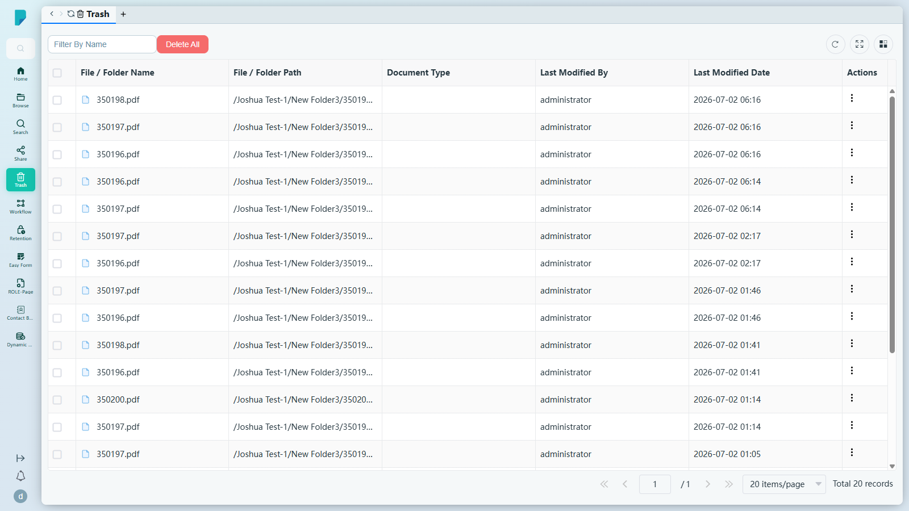
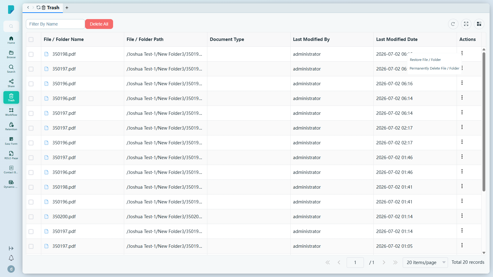

# Trash（回收站）

**選單路徑：** Client → Trash

## 此畫面的用途
這是刪除操作的安全網——從檔案庫移除的所有內容都會先進入這裡，因此誤刪只需一按即可還原，而毋須變成支援工單。

## 工具列與操作
- **Filter By Name**（按名稱篩選）——輸入文字以按檔案／資料夾名稱篩選回收站列表。
- **Delete All**（全部刪除）——清空整個回收站（永久性；未經測試——破壞性操作）。
- **Refresh**（重新整理）——重新載入列表。
- **Full screen**（全螢幕）——切換表格全螢幕顯示。
- **Column settings**（欄位設定）——顯示／隱藏表格欄位。

## 列表與欄位
- 每列設有剔選框，欄位包括：**File / Folder Name**、**File / Folder Path**（項目被刪除前的所在位置）、**Document Type**、**Last Modified By**、**Last Modified Date**、**Actions**。
- 每列的 **Actions (⋮)**（操作）：
  - **Restore File / Folder**——將項目還原至原本位置。
  - **Permanently Delete File / Folder**——永久移除該項目。
- 分頁列：**Jump up page**（第一頁）、**Previous page**（上一頁）、頁碼輸入框、**Next page**（下一頁）、**Jump down page**（最後一頁）、每頁筆數選擇器（預設 **20 items/page**）、**Total N records** 總筆數計數器（此網站共 20 筆記錄）。

## 測試網站觀察記錄
- 列表載入了真實的已刪除項目（例如從 `/Joshua Test-1/` 移除的 PDF）。測試期間並未執行任何還原或永久刪除操作。

## 誰會使用
所有用戶——任何曾經誤刪檔案的人。
