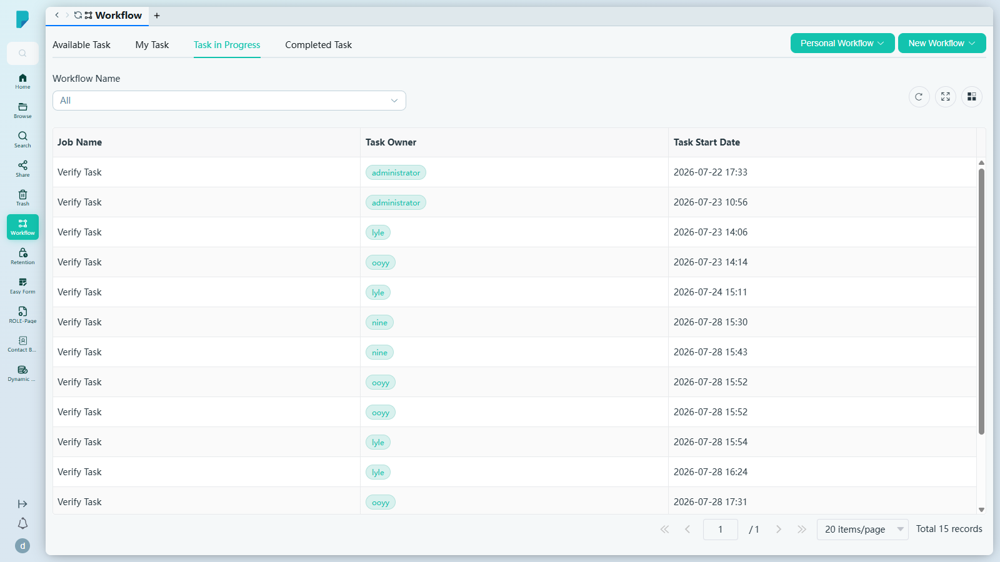
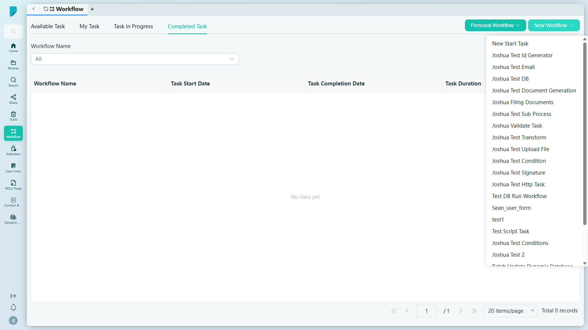
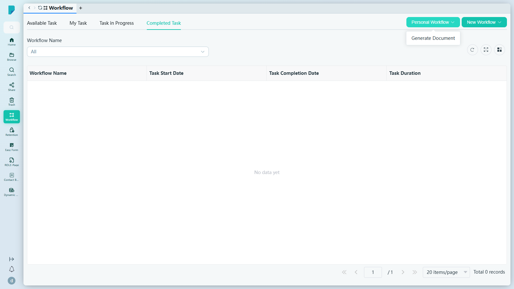

# Workflow（工作流程）

**選單路徑：** Client → Workflow

## 此畫面的用途
你的工作流程中控台——在同一處啟動新流程、接手正等待你處理的任務，以及追蹤所有已在審批鏈中流轉的項目。

## 工具列與操作
- **Personal Workflow**（個人工作流程，下拉選單）——個人工作流程操作。此網站上顯示：**Generate Document**（產生文件）。
- **New Workflow**（新增工作流程，下拉選單）——啟動工作流程。第一個選項為 **New Start Task**（新開始任務），其後列出所有已設定的工作流程範本（此網站共 22 個，例如 Joshua Test Email、Joshua Test Document Generation、Batch Update Dynamic Database、Test Script Task）。選擇其中一個即會啟動該工作流程——未經測試，以免在真實資料上啟動工作流程。
- **Workflow Name**（工作流程名稱）——按工作流程篩選任務列表（選項：All 加上同樣的 22 個範本）。
- **Refresh**（重新整理）——重新載入列表。
- **Full screen**（全螢幕）——切換表格全螢幕顯示。
- **Column settings**（欄位設定）——顯示／隱藏表格欄位。

## 分頁
- **Available Task**（可接手的任務）——你可以認領的任務。欄位：Task Name、Task Owner、Status、Task Start Date、Task Due Date。（此網站為空白。）
- **My Task**（我的任務）——你的任務。欄位：Job Name、Task Owner、Task Start Date、Last Modified Date。（此網站為空白；此為預設分頁。）
- **Task in Progress**（進行中的任務）——正在執行的工作流程作業。欄位：Job Name、Task Owner、Task Start Date。（此網站共 15 筆記錄——由 administrator、lyle、ooyy、nine 擁有的「Verify Task」作業。）
- **Completed Task**（已完成任務）——已完成的執行。欄位：Workflow Name、Task Start Date、Task Completion Date、Task Duration。（此網站為空白。）

## 列表與欄位
- 每個分頁各有自己的欄位組合（如上所列），並設有標準分頁列：**Jump up page**（第一頁）、**Previous page**（上一頁）、頁碼輸入框、**Next page**（下一頁）、**Jump down page**（最後一頁）、每頁筆數選擇器（預設 **20 items/page**）、**Total N records** 總筆數計數器。

## 測試網站觀察記錄
- 全部四個分頁及兩個下拉選單在 sit-v3 上均正常載入；未發現錯誤。測試期間並未啟動任何工作流程。

## 誰會使用
任何需要審批、檢閱或啟動文件流程的人——由偶爾批核的用戶到流程負責人皆適用。
