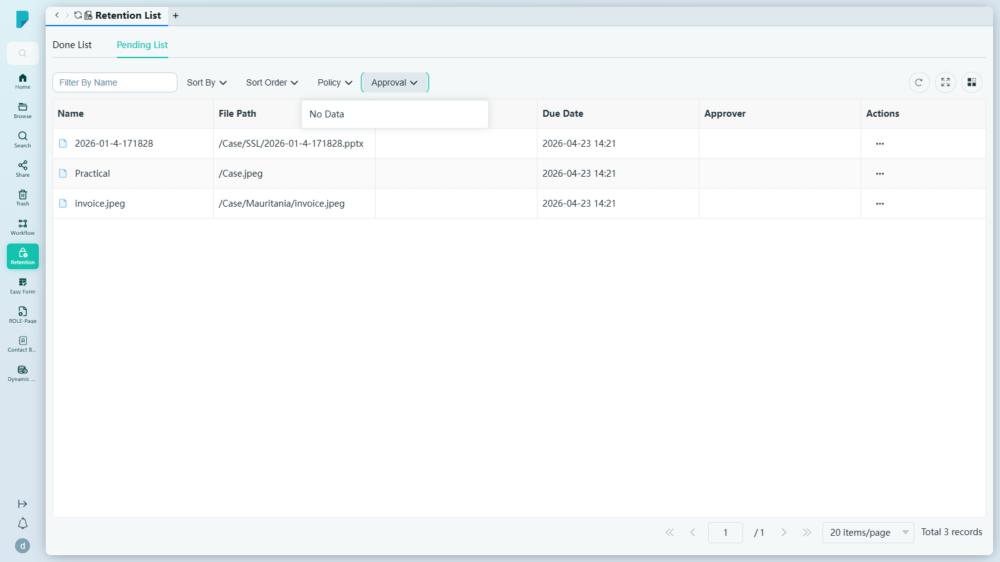

# Retention List（保存期限列表）

**選單路徑：** Client → Retention → Retention List

## 此畫面的用途
追蹤需要進行保存期限覆核的文件——哪些正在等待決定、哪些已獲批准——確保保存期限不會在不知不覺間溜走。

## 分頁
- **Pending List**（待處理列表，預設）——等待保存期限覆核的項目。欄位：**Name**、**File Path**、**Policy Name**、**Due Date**、**Approver**、**Actions**。此網站共 3 筆記錄（例如 `/Case/SSL/2026-01-4-171828.pptx`，到期日 2026-04-23 14:21）。
- **Done List**（已完成列表）——已獲批准的項目。欄位：**Name**、**File Path**、**Policy Name**、**Approver**、**Approved Date**、**Actions**。（此網站為空白。）

## 工具列與操作
- **Filter By Name**（按名稱篩選）——輸入文字以按名稱篩選列表。
- **Sort By**（排序依據）／ **Sort Order**（排序方式）——排序下拉選單。在此測試網站上，兩者打開後均顯示空白面板（沒有顯示任何選項）。
- **Policy**（政策）——按保存政策篩選。在此測試網站上打開後顯示空白面板。
- **Approval**（審批）——按審批狀態篩選。在此測試網站上打開後顯示空白面板。
- **Refresh**（重新整理）——重新載入列表。
- **Full screen**（全螢幕）——切換表格全螢幕顯示。
- **Column settings**（欄位設定）——顯示／隱藏表格欄位。
- **每列 Actions (⋯)**——在此測試網站上點按後沒有顯示任何選單（這些項目沒有可用的操作）。

## 列表與欄位
- 各分頁的欄位如上所列。
- 分頁列：**Jump up page**（第一頁）、**Previous page**（上一頁）、頁碼輸入框、**Next page**（下一頁）、**Jump down page**（最後一頁）、每頁筆數選擇器（預設 **20 items/page**）、**Total N records** 總筆數計數器。

## 測試網站觀察記錄
- 頁面正常載入；沒有錯誤提示橫額。在 sit-v3 上觀察到的異常情況：Sort By／Sort Order／Policy／Approval 下拉選單及每列的 ⋯ 操作按鈕均顯示為空白／無內容。並未對任何文件執行保存操作。

## 誰會使用
負責覆核保存期限即將屆滿之文件的記錄管理人員及合規人員。
