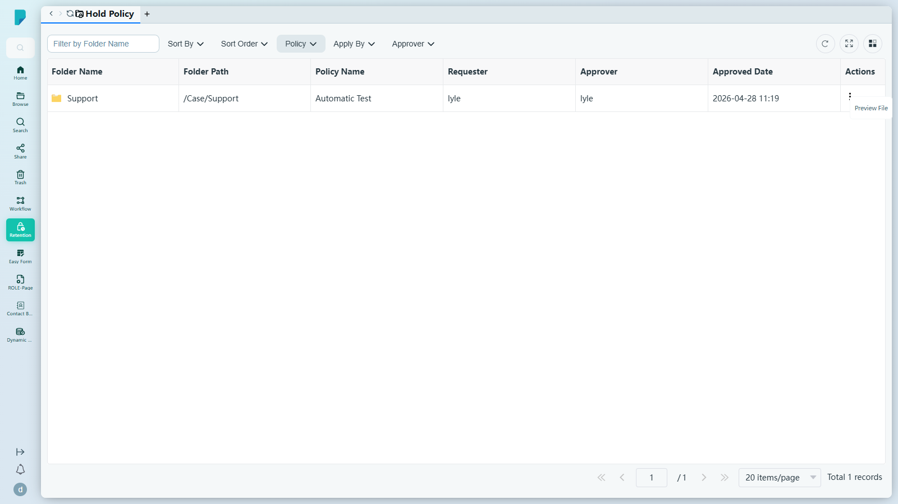

# Hold Policy（保留政策）

**選單路徑：** Client → Retention → Hold Policy

## 此畫面的用途
檢視目前處於法律／合規保留狀態的每個資料夾——由哪項政策保留、誰提出申請、誰批准——確保受保護的記錄不會被意外更改或銷毀。

## 工具列與操作
- **Filter by Folder Name**（按資料夾名稱篩選）——輸入文字以按名稱篩選被保留的資料夾。
- **Sort By**（排序依據）／ **Sort Order**（排序方式）——排序下拉選單。在此測試網站上打開後顯示空白面板（沒有顯示任何選項）。
- **Policy**（政策）——按保留政策篩選。在此測試網站上打開後顯示空白面板。
- **Apply By**（申請人）——按提出保留申請的人篩選。
- **Approver**（審批人）——按審批人篩選。
- **Refresh**（重新整理）——重新載入列表。
- **Full screen**（全螢幕）——切換表格全螢幕顯示。
- **Column settings**（欄位設定）——顯示／隱藏表格欄位。

保留是在 **Browse**（瀏覽）中施加的（工具列 → **Add Hold Policy**——見 [[02-browse]]）。

## 列表與欄位
- 欄位：**Folder Name**、**Folder Path**、**Policy Name**、**Requester**、**Approver**、**Approved Date**、**Actions**。
- 此網站共 1 筆記錄——資料夾 **Support**（`/Case/Support`）由政策 **"Automatic Test"** 保留，由 lyle 於 2026-04-28 11:19 提出並批准。
- **每列 Actions (⋯)**——在此測試網站上點按後沒有顯示任何選單。
- 分頁列：**Jump up page**（第一頁）、**Previous page**（上一頁）、頁碼輸入框、**Next page**（下一頁）、**Jump down page**（最後一頁）、每頁筆數選擇器（預設 **20 items/page**）、**Total N records** 總筆數計數器。

## 測試網站觀察記錄
- 頁面正常載入；沒有錯誤提示橫額。與 Retention List 相同的異常情況：篩選下拉選單及每列的 ⋯ 按鈕在 sit-v3 上均顯示為空白／無內容。測試期間並未施加或解除任何保留。

## 誰會使用
需要即時檢視所有處於法律保留狀態項目的合規人員及記錄管理人員。
