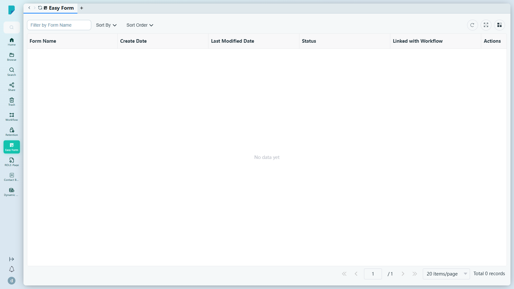

# Easy Form（簡易表格）

**選單路徑：** Client → Easy Form

## 此畫面的用途
你的 Easy Form 表格庫——毋須紙張即可收集資訊的數碼表格。每份表格均顯示其狀態及是否已連結工作流程，讓你隨時掌握哪些表格已可使用。

## 工具列與操作
- **Sort By**（排序依據）——排序表格列表。
- **Sort Order**（排序方式）——遞增／遞減。

## 列表與欄位
- 欄位：**Form Name**、**Create Date**、**Last Modified Date**、**Status**、**Linked with Workflow**、**Actions**。
- 分頁列：頁面導覽及 **Total N records** 總筆數計數器。

## 測試網站觀察記錄
- **測試網站上的已知問題：** Easy Form 列表因後端 500 錯誤而載入失敗（提示訊息："Request failed with status code 500"），因此無法顯示表格——出錯後頁面顯示「No data yet / Total 0 records」（見 `client-15-easy-form-500-error.png`）。受此問題影響，表格列、填寫表格檢視及任何新增選項均無法探索。

## 誰會使用
需要填寫、提交或管理數碼表格的用戶。
