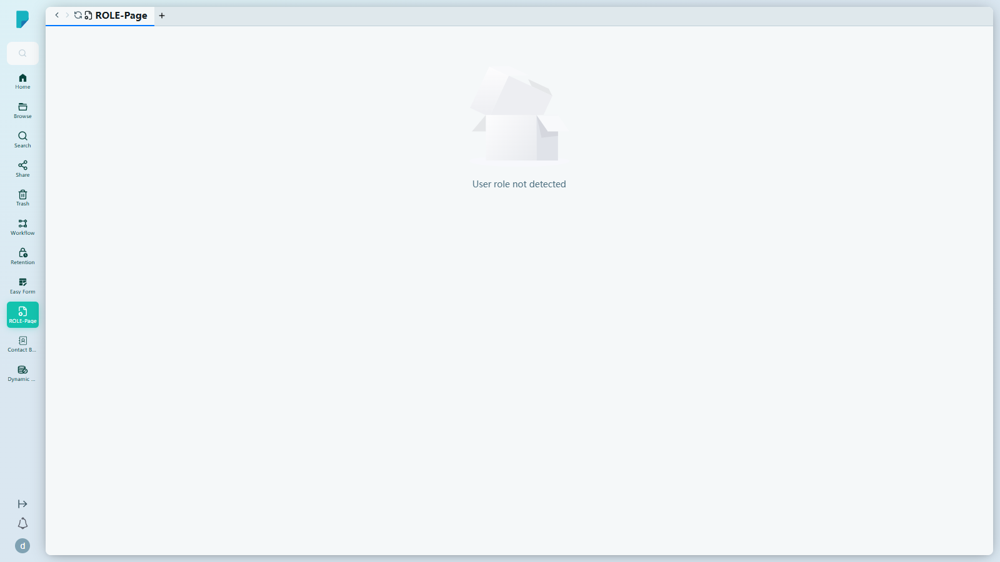

# ROLE-Page

**選單路徑:** Client → ROLE-Page

## 此畫面的用途
一個按角色度身訂做的登陸頁面，讓每類用戶都能看到對他們最重要的工具與資訊。此處顯示的內容由管理員按角色設定。

## 工具列與操作
- 此畫面沒有可見的工具列——它是一個顯示頁，內容取決於角色設定。

## 列表與欄位
- 沒有列表或表格。

## 測試網站備註
- 示範帳戶看到 **"User role not detected"**——這是按角色設定後的狀態，並非錯誤：此帳戶尚未指派任何角色頁面。已設定角色的帳戶會在此看到其角色專屬的儀表板。

## 誰會使用
每位用戶——頁面內容會隨管理員所指派的角色而調整。
