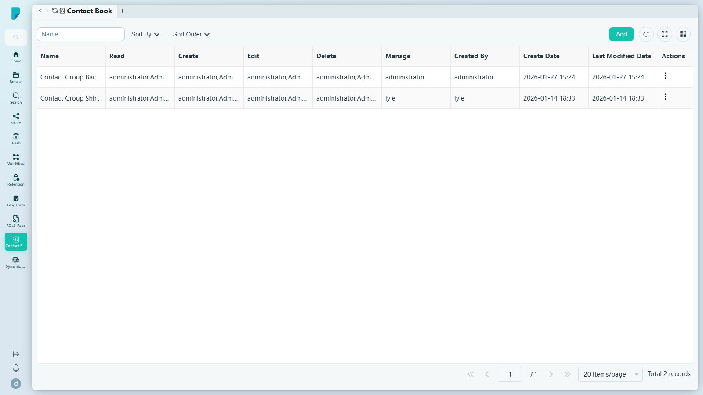
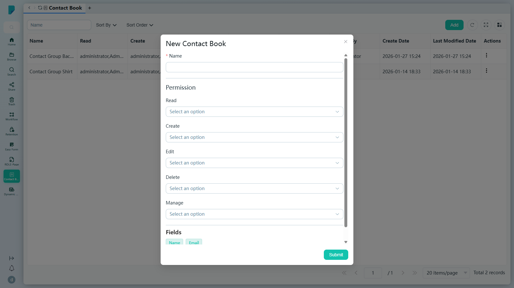
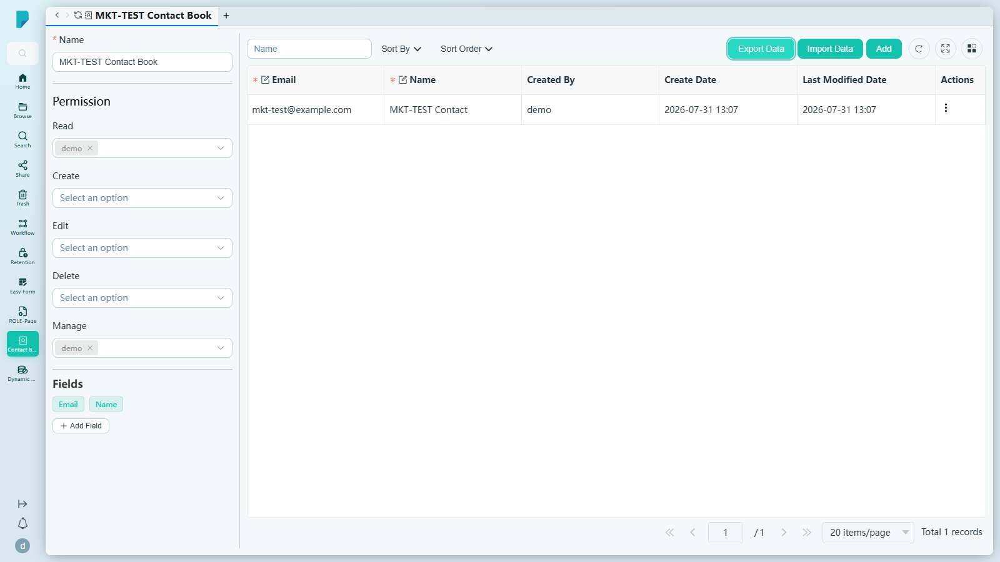
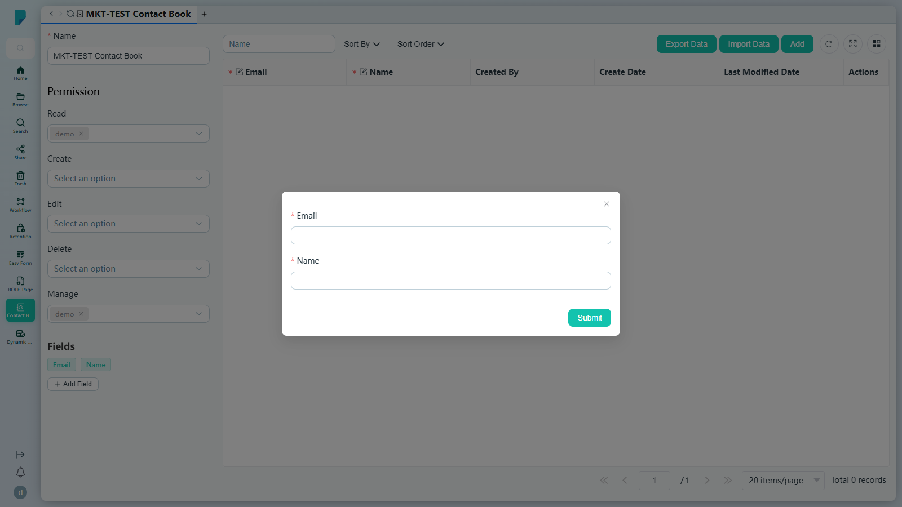

# Contact Book

**選單路徑:** Client → Contact Book

## 此畫面的用途
把共享通訊錄放在文件旁邊，讓文件背後的人員永遠只需一按即可找到。細緻的權限控制可精確設定誰可以讀取、新增、編輯、刪除或管理每本通訊錄。

## 工具列與操作
- **Name**——按通訊錄名稱篩選列表。
- **Sort By** / **Sort Order**——排序列表。
- **Add**——建立新通訊錄（見下方對話框）。
- **Refresh**、**Full screen**、**Column settings**——標準表格工具。

## 列表與欄位
- 欄位：**Name**、**Read**、**Create**、**Edit**、**Delete**、**Manage**（每個權限欄列出獲授權的用戶/群組，例如 "administrator, Administrators Group"）、**Created By**、**Create Date**、**Last Modified Date**、**Actions**。
- 分頁列：**Jump up page**（第一頁）、**Previous page**、頁碼輸入框、**Next page**、**Jump down page**（最後一頁）、每頁筆數選擇器（預設 **20 items/page**）、**Total N records** 計數器（此網站有 2 本通訊錄，例如 "Contact Group Bacon"）。
- 點按一本通訊錄會開啟其詳細檢視（見下）。

## 對話框與面板
### New Contact Book (Add)

- **Name***——通訊錄名稱。
- **Permission**——按動作分別選擇用戶/群組：**Read**、**Create**、**Edit**、**Delete**、**Manage**（建立者會自動加入 Read 及 Manage）。
- **Fields**——此通訊錄內每位聯絡人所需的欄位；預設為 **Name** 及 **Email**，可按 **Add Field** 加入更多。
- **Submit**——建立通訊錄並開啟其詳細檢視。（已測試：建立了 "MKT-TEST Contact Book"。）

### 通訊錄詳細檢視

- 頂部表單顯示通訊錄的 **Name**、**Permission** 選擇器（標籤顯示目前獲授權者，例如 demo）及 **Fields**（Email、Name、Add Field）。
- 聯絡人列表工具列：**Name** 篩選、**Sort By**、**Sort Order**、**Export Data**（下拉選單：**Export Excel**、**Export CSV**、**Export vCard(VCF)**）、**Import Data**、**Add**（新增聯絡人）。
- 聯絡人欄位：**Email***、**Name***（兩者均標示為必填）、**Created By**、**Create Date**、**Last Modified Date**、**Actions**。

### 新增聯絡人

- 每個通訊錄欄位各有一個輸入框——此處為 **Email*** 及 **Name***——再加上 **Submit**。（已測試：建立了 "MKT-TEST Contact" <mkt-test@example.com>。）

## 測試網站備註
- 已建立的測試資料：通訊錄 **"MKT-TEST Contact Book"**，內有一位聯絡人 **"MKT-TEST Contact"**（mkt-test@example.com）。
- 現有範例通訊錄："Contact Group Bacon"、"Contact Group Shirt"。（它們的權限欄顯示字面的 "null" 項目——此網站的資料小異常。）

## 誰會使用
為客戶、供應商或專案管理共享聯絡人名單的團隊。
