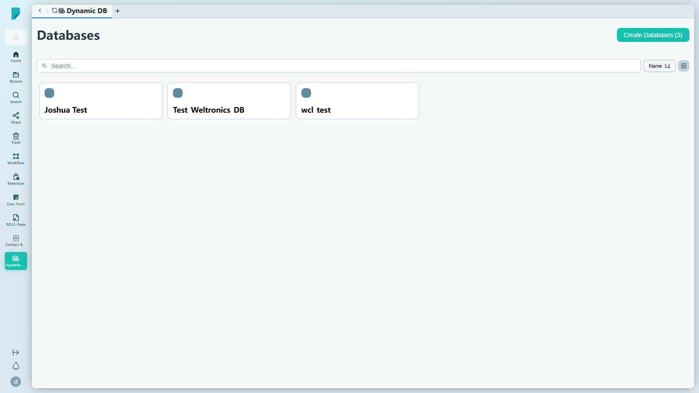
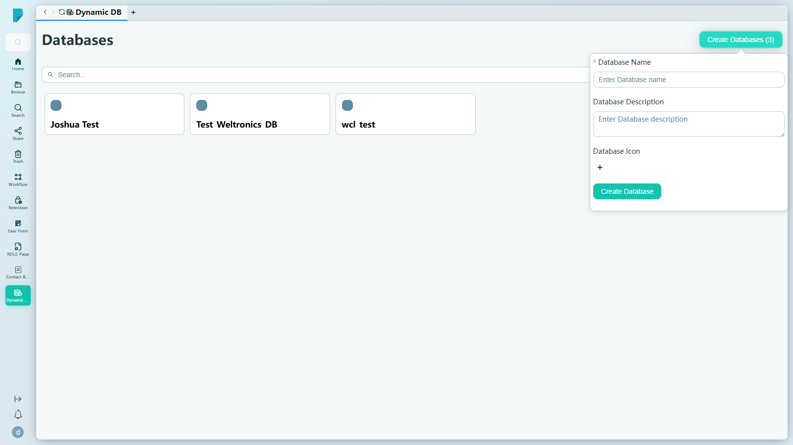
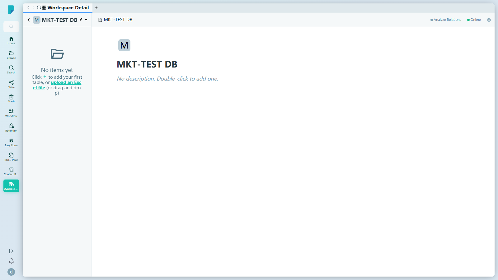

# Dynamic DB

**選單路徑:** Client → Dynamic DB

## 此畫面的用途
你的動態資料庫就在文件旁邊——可以瀏覽、搜尋及在其中建立資料表的結構化業務資料，全程無需離開 DocPal。

## 工具列與操作
- **Create Databases (N)**——開啟建立表單（見下）；括號內的數字顯示現有資料庫數量（測試前此網站有 3 個）。
- **Search...**——按名稱篩選資料庫卡片。
- 資料庫以**卡片**形式顯示（圖示 + 名稱）：此網站上有 Joshua Test、Test_Weltronics_DB、wcl_test。點按卡片即可開啟其工作區。

## 對話框與面板
### Create Database

- **Database Name***——文字欄位（"Enter Database name"）。
- **Database Description**——多行文字。
- **Database Icon**——"Select an icon" 選擇器（+ 按鈕）。
- **Create Database**——建立資料庫並開啟其工作區。（已測試：建立了 "MKT-TEST DB"。）

### 資料庫工作區（建立後或點按卡片後開啟）

- 顯示資料庫名稱、一個 **Online** 狀態徽章，以及描述（"No description. Double-click to add one."）。
- **Analyze Relations**——分析資料表之間的關係。
- 空白狀態："No items yet — Click + to add your first table, or upload an Excel file (or drag and drop)"。

## 測試網站備註
- 已建立的測試資料：資料庫 **"MKT-TEST DB"**（空白，沒有資料表）。
- 頁面及建立流程在 sit-v3 上運作正常；未發現錯誤。

## 誰會使用
需要結構化業務資料、又不想離開 DocPal 的用戶。
