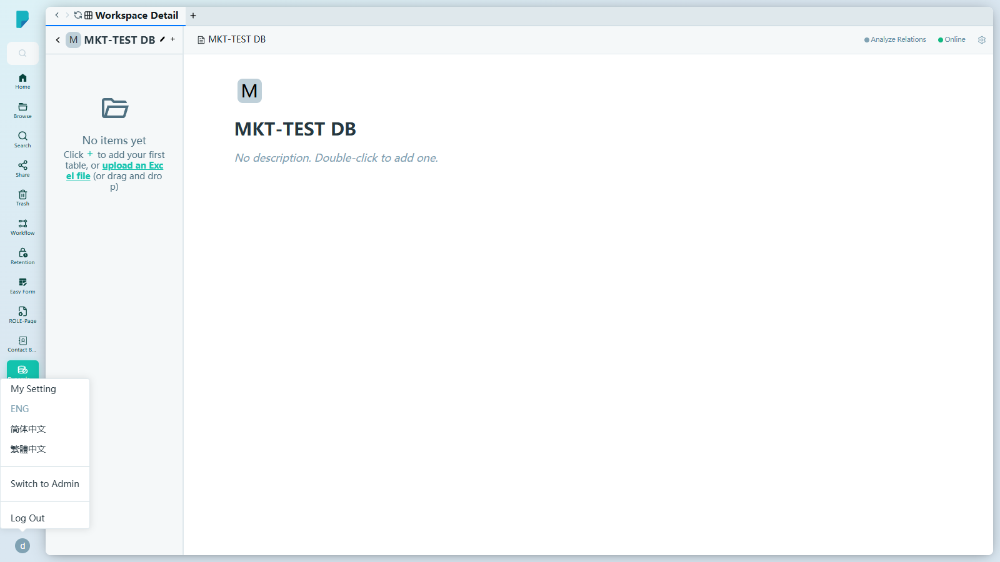
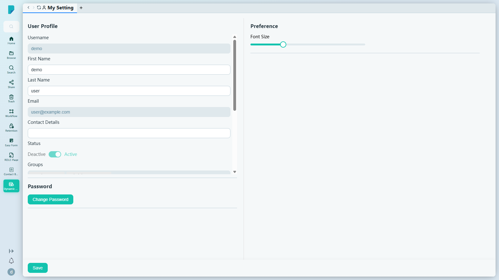
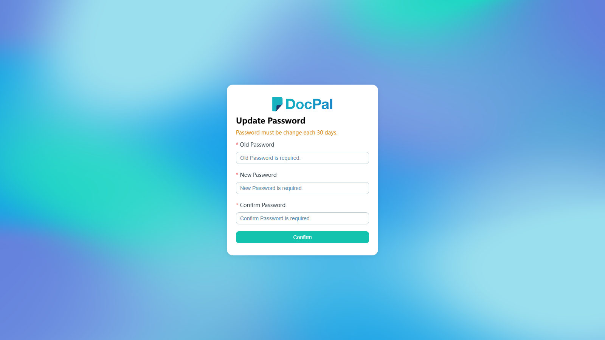

# Account Menu

**選單路徑:** Client → Account Menu（左側邊欄底部的頭像）

## 此畫面的用途
頭像下拉選單——你的個人控制項隨手可得：設定、語言及工作階段操作，全部收納在一個小巧的選單中。

## 選單項目
- **My Setting**——開啟你的個人設定頁面（見下）。
- **ENG / 简体中文 / 繁體中文**——介面語言選項（英文、簡體中文、繁體中文）。目前使用的語言會以停用狀態顯示（此帳戶為 ENG）。
- **Switch to Admin**——跳轉至管理後台（僅限管理員；未測試）。
- **Log Out**——結束工作階段（未測試）。

## 對話框與面板
### My Setting

以獨立頁面開啟，分為三個部分：

- **User Profile**
  - **Username**——唯讀（demo）。
  - **First Name** / **Last Name**——可編輯（demo / user）。
  - **Email**——唯讀。
  - **Contact Details**——可編輯文字。
  - **Status**——Active/Deactive 開關，唯讀（Active）。
  - **Groups**——唯讀；顯示你所屬的群組（此帳戶：Members Group、Administrators Group）。
  - **Role**、**Department**、**Company**——唯讀。
  - **Registered**——唯讀（此帳戶顯示 "Pending"）。
  - **User Level**——唯讀（"Standard"）。
- **Password**——**Change Password** 按鈕。
- **Preference**——**Font Size** 滑桿（10–24，預設 14）。
- **Save**——儲存個人資料及偏好設定的變更（未測試）。

### Update Password（由 Change Password 開啟）

Change Password 會開啟一個專用頁面（"Password must be change each 30 days."）：
- **Old Password**、**New Password**、**Confirm Password** 及 **Confirm**（未提交）。

## 測試網站備註
- 以上內容已在 sit-v3 以 demo 帳戶驗證；未發現錯誤。語言未曾切換，Switch to Admin / Log Out 亦未曾點按。

## 誰會使用
每位已登入用戶；Switch to Admin 選項僅對管理員顯示。
