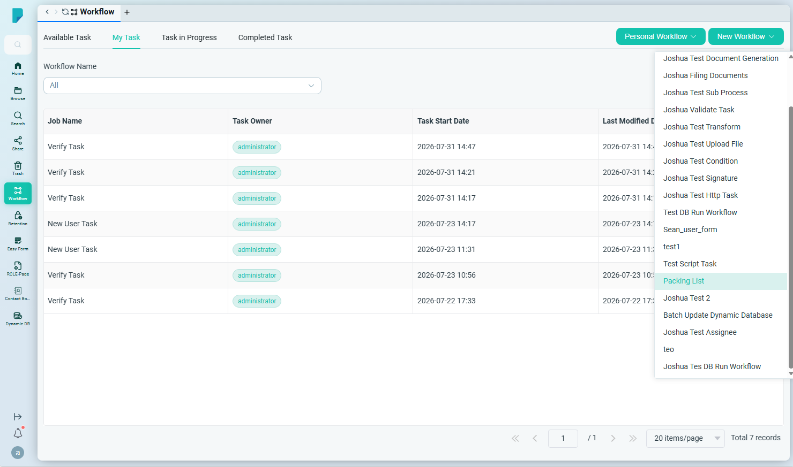
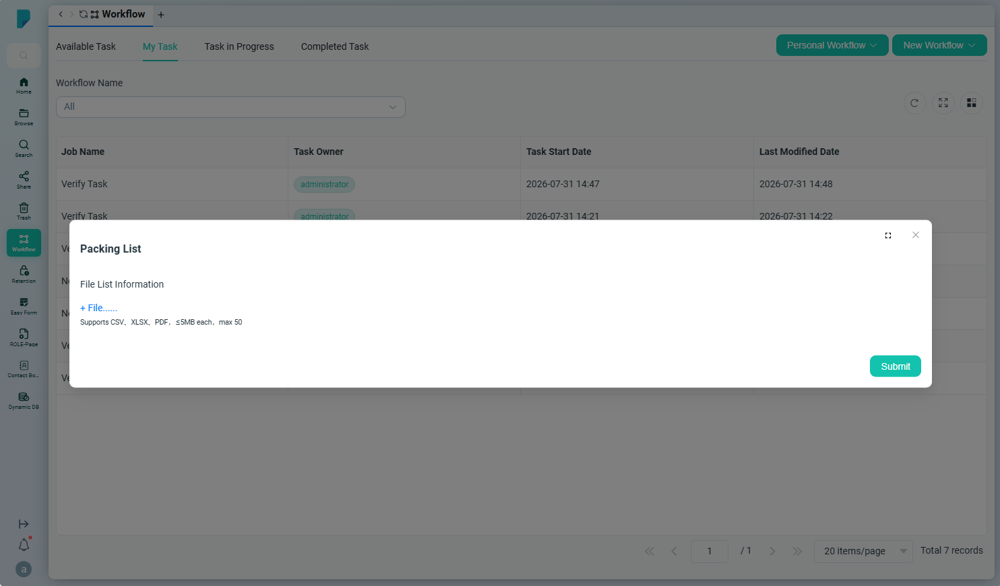
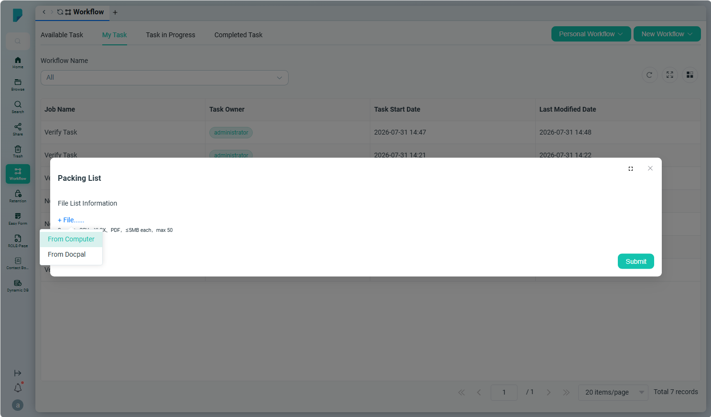
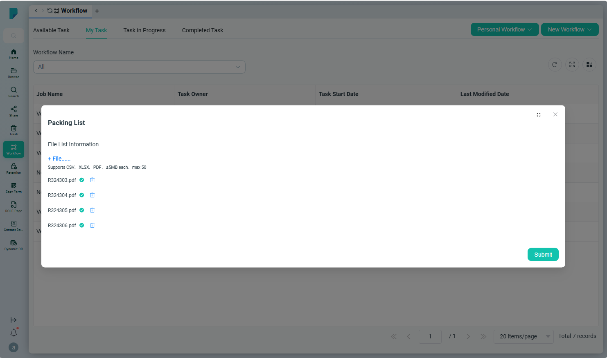
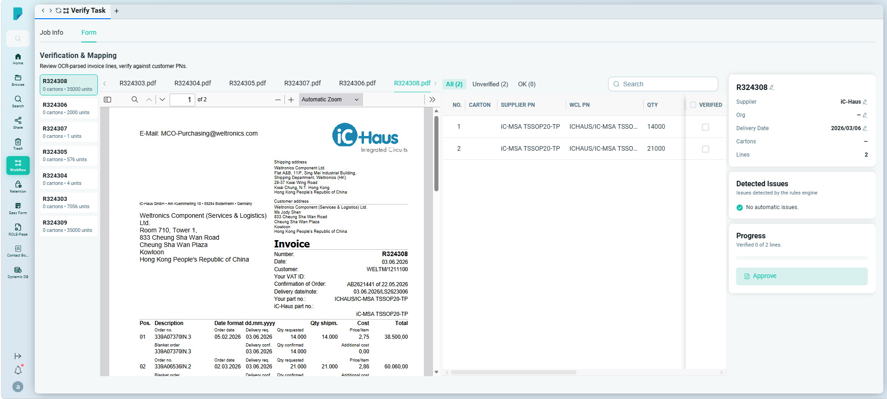
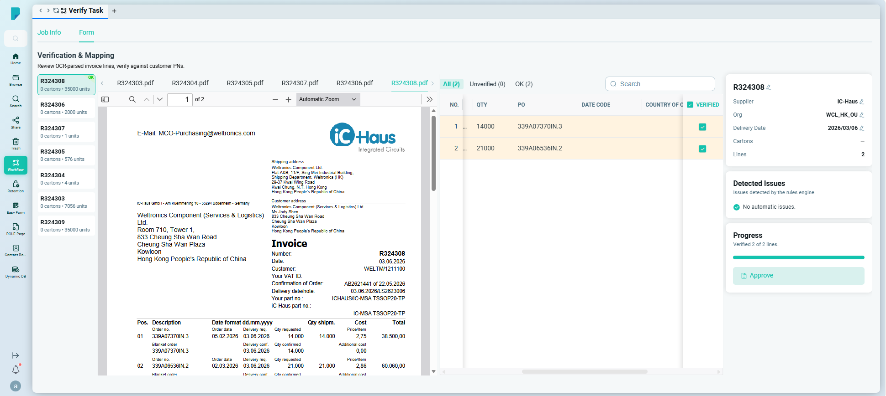

# WMS Verification

**選單路徑：** Client → Workflow → New Workflow → Packing List

## 此畫面的用途
透過工作流程上載裝箱單（Packing List）等文件，由系統進行 OCR 辨識；用戶核對及修正辨識結果並批准後，數據會傳送至 WMS PDA 系統。

## 操作步驟

- **步驟 1：** 開啟 **Workflow**，按一下 **New Workflow**，選擇 **Packing List**。

- **步驟 2：** 系統會顯示一個新表格。

- **步驟 3：** 用戶可以從本機電腦或從 DocPal 選取檔案。

- **步驟 4：** 所有文件上載完成後，按一下 **Submit**。

- **步驟 5：** 系統會處理檔案，用戶可查看任務詳情：左側是已上載的文件列表，接著是所選文件的預覽；右側是以表格形式顯示的 OCR 數據，用戶可按一下儲存格編輯內容；下方是發票（invoice）資料，同樣可按一下編輯。

- **步驟 6：** 用戶核對內容後，勾選 **Verify** 核取方塊，然後在 invoice detail 上按一下 **Approve**，批准該發票。

- **步驟 7：** 確認後，左側文件列表的檔名旁會顯示 **[ok]** 標記。所有文件確認完成後，用戶即可提交工作流程，數據會傳送至 PDA。

## 誰會使用
需要把裝箱單等紙本或電子文件數據核對後匯入 WMS PDA 系統的倉務及文件處理人員。
