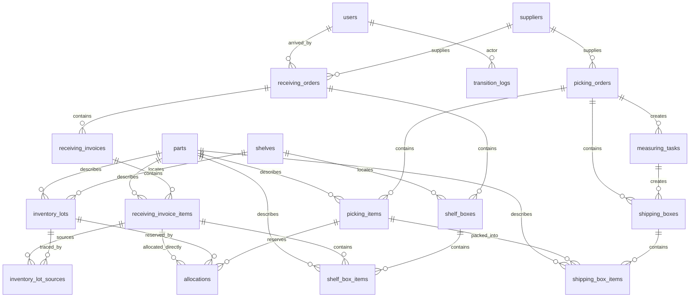

# Documentation Refresh Implementation Plan

> **Status:** Completed. This plan was executed and later superseded by a further README/AGENTS cleanup that removed references to deleted demo pages and components.

> **For agentic workers:** REQUIRED SUB-SKILL: Use superpowers:subagent-driven-development (recommended) or superpowers:executing-plans to implement this plan task-by-task. Steps use checkbox (`- [ ]`) syntax for tracking.

**Goal:** Update the project documentation so users and coding agents can understand the app, its data model, and how to work on it.

**Architecture:** Three documents: a refreshed `README.md` for end users, a new `docs/database-relations.md` reference with an ER diagram and table summaries, and a new `AGENTS.md` instruction file for coding agents.

**Tech Stack:** Markdown only. No code changes.

---

## File Structure

| File | Responsibility |
|------|----------------|
| `README.md` | Existing user-facing guide. Updated paths, features, routes, project structure, and limitations. |
| `docs/database-relations.md` | New reference: Mermaid ER diagram, per-table summary, relation rules, allocation lifecycle. |
| `AGENTS.md` | New instruction file for coding agents: stack, commands, conventions, testing, demo limitations. |

---

### Task 1: Refresh README.md

**Files:**
- Modify: `README.md`

- [x] **Step 1: Fix running instructions path**

Replace:
```markdown
```bash
cd apps/web-demo
pnpm install
pnpm run dev
```
```

With:
```markdown
```bash
pnpm install
pnpm run dev
```
```

- [x] **Step 2: Fix project structure root path**

Replace:
```markdown
```
apps/web-demo/
├── app.vue                  # PGlite bootstrap, schema init, seed, auth restore
```
```

With:
```markdown
```
├── app.vue                  # PGlite bootstrap, schema init, seed, auth restore
```
```

- [x] **Step 3: Add OCR-assisted picking to Workflow A**

After the sentence in Workflow A step 4 ("The worker can open the receiving order in **Picking view** to see which picking orders need goods from this shipment, pick them out, and reduce the receiving-area stock."), add:

```markdown
The worker can also use the **scan button** on the Picking tab to type label data (part number, quantity, date/lot code, and origin country). The system matches the input to linked receiving and picking records and applies the pick automatically.
```

- [x] **Step 4: Add pending picking order count badge**

In the **Receiving** bullet under **Supporting actions**, replace:
```markdown
- **Receiving** — confirm arrivals, report mismatches, and create receiving-area inventory lots.
```

With:
```markdown
- **Receiving** — confirm arrivals, report mismatches, create receiving-area inventory lots, and see at a glance how many picking orders still need stock from each receiving order.
```

- [x] **Step 5: Update routes table**

Replace the `/receiving/:id` row:
```markdown
| `/receiving/:id` | Receiving order detail with Receiving and Picking views |
```

With:
```markdown
| `/receiving/:id` | Receiving order detail; **Receiving** view shows invoices/items, **Picking** view shows linked picking orders and the scan modal |
```

- [x] **Step 6: Update project structure**

Replace the `composables/` entry:
```markdown
│   ├── useAuth.ts           # Login/logout/restore
│   ├── useCurrentUser.ts    # Current operator helper
│   └── useDb.ts             # Drizzle client from provided PGlite
```

With:
```markdown
│   ├── useAuth.ts           # Login/logout/restore
│   ├── useCurrentUser.ts    # Current operator helper
│   ├── useDb.ts             # Drizzle client from provided PGlite
│   ├── useMockOcr.ts        # Parses typed label input for the scan modal
│   └── useOcrPicking.ts     # Matches scanned input to receiving/picking records
```

Replace the `components/` entry:
```markdown
├── components/AppHeader.vue # Header with back button, reset DB, logout
```

With:
```markdown
├── components/
│   ├── AppHeader.vue        # Header with back button, reset DB, logout
│   └── OcrScanModal.vue     # Typed-label scan modal for OCR-assisted picking
```

Replace the `db/` entry:
```markdown
│   ├── allocate.ts          # Allocation logic (shelved first, then arrivals)
│   ├── goodsVerify.ts       # Goods verify DB helpers
│   ├── init.ts              # Raw Postgres DDL for first-time bootstrap
│   ├── measuring.ts         # Measuring / shipping box helpers
│   ├── picking.ts           # Picking DB helpers
│   ├── putAway.ts           # Put-away DB helpers
│   ├── receiving.ts         # Receiving DB helpers
│   ├── schema.ts            # Drizzle pg-core table definitions
│   └── seed.ts              # Demo users, suppliers, parts, orders, inventory
```

With:
```markdown
│   ├── allocate.ts          # Allocation logic (shelved first, then arrivals)
│   ├── goodsVerify.ts       # Goods verify DB helpers
│   ├── init.ts              # Raw Postgres DDL for first-time bootstrap
│   ├── measuring.ts         # Measuring / shipping box helpers
│   ├── ocrPicking.ts        # OCR-assisted picking matching and apply logic
│   ├── picking.ts           # Picking DB helpers
│   ├── putAway.ts           # Put-away DB helpers
│   ├── receiving.ts         # Receiving DB helpers
│   ├── schema.ts            # Drizzle pg-core table definitions
│   └── seed.ts              # Demo users, suppliers, parts, orders, inventory
```

Add a `docs/` entry after the `db/` block:
```markdown
├── docs/
│   └── superpowers/         # Design specs and implementation plans
│       ├── specs/
│       └── plans/
```

- [x] **Step 7: Update limitations**

Replace:
```markdown
- **Scanning is typed input.** There is no camera/barcode integration; the operator types part numbers into a text field.
```

With:
```markdown
- **Scanning is typed input.** There is no camera/barcode integration yet; the operator types part numbers and label data into a text field. The parsing logic normalizes input and applies simple OCR-style substitutions (e.g. `O` → `0`) so the demo can simulate real scan errors.
- **No automated test suite.** Verification is currently manual browser testing plus `pnpm nuxt prepare` for TypeScript generation.
```

- [x] **Step 8: Commit README changes**

```bash
git add README.md
git commit -m "docs(README): refresh paths, features, and project structure"
```

---

### Task 2: Create docs/database-relations.md

**Files:**
- Create: `docs/database-relations.md`

- [x] **Step 1: Write the file**

Create `docs/database-relations.md` with the following content:

```markdown
# Database Relations

This document describes the tables in the PGlite warehouse demo and how they relate to each other.

## ER diagram



## Table summary

| Table | Purpose | Key references |
|-------|---------|----------------|
| `users` | Demo operator/admin accounts | — |
| `suppliers` | Suppliers referenced by orders | — |
| `parts` | Parts referenced by invoices, lots, picking items | — |
| `shelves` | Shelf locations | — |
| `receiving_orders` | Incoming shipments | `supplier_id` → `suppliers` |
| `receiving_invoices` | Invoices within a receiving order | `receiving_order_id` → `receiving_orders` |
| `receiving_invoice_items` | Lot-level expected/received detail | `receiving_invoice_id`, `part_id` |
| `inventory_lots` | Stock view, unique by part/date/lot/origin/location | `part_id`, `shelf_code`, `box_id` |
| `inventory_lot_sources` | Traceability: which receiving invoice item produced a lot | `inventory_lot_id`, `receiving_invoice_item_id` |
| `picking_orders` | Outgoing shipments to customers | `supplier_id` → `suppliers` |
| `picking_items` | Lines to pick within a picking order | `picking_order_id`, `part_id` |
| `allocations` | Reservation of stock for a picking item | `picking_item_id`, `inventory_lot_id` (optional), `receiving_invoice_item_id` (optional) |
| `measuring_tasks` | Packing task created when a picking order is finished | `picking_order_id` |
| `shipping_boxes` | Boxes used to ship a finished picking order | `picking_order_id`, `measuring_task_id` |
| `shipping_box_items` | Items packed into a shipping box | `shipping_box_id`, `picking_item_id`, `part_id` |
| `shelf_boxes` | Boxes created during put-away | `receiving_order_id`, `shelf_code` |
| `shelf_box_items` | Items moved into a shelf box | `shelf_box_id`, `receiving_invoice_item_id`, `part_id` |
| `transition_logs` | Audit log of status changes | `actor_id` → `users` |

## Relation rules

- **Receiving → inventory.** A `receiving_invoice_item` feeds stock into `inventory_lots` in two ways:
  - Directly, as a receiving-area lot (`shelf_code = NULL, box_id = NULL`) used before put-away.
  - Through `inventory_lot_sources`, which links a located lot back to its originating receiving invoice item for traceability.
- **Picking → inventory.** A `picking_item` reserves stock through `allocations`. An allocation points to either:
  - An `inventory_lot` (shelved, shelf-box, or receiving-area lot), or
  - A `receiving_invoice_item` (direct reservation before the lot is materialized).
- **Boxes.** `shelf_boxes` group items moved into storage; `shipping_boxes` group items packed for a customer.
- **State changes.** Every status change for `receiving_orders`, `picking_orders`, `shelf_boxes`, `shipping_boxes`, and `measuring_tasks` is recorded in `transition_logs`.

## Allocation lifecycle

1. **Created.** When stock becomes available or a new picking order arrives, `db/allocate.ts` creates `allocations` rows reserving quantity for each picking item.
2. **Materialized.** Before picking from a receiving-area allocation, `db/picking.ts` creates a dedicated `inventory_lots` row and moves or splits the allocation onto that lot.
3. **Picked.** `db/picking.ts` confirms the picked quantity, reduces the allocation, and updates `picking_items.picked_qty` and `inventory_lots` totals.
4. **Removed.** When an allocation is fully picked, it is deleted.
```

- [x] **Step 2: Commit the new file**

```bash
git add docs/database-relations.md
git commit -m "docs: add database relations reference"
```

---

### Task 3: Create AGENTS.md

**Files:**
- Create: `AGENTS.md`

- [x] **Step 1: Write the file**

Create `AGENTS.md` at the project root with the following content:

```markdown
# Agent Instructions

This is a client-side Nuxt 3 proof-of-concept for warehouse mobile/Android flows. It runs a full Postgres database in the browser using PGlite, so the demo works without a backend.

## Tech stack

- **Framework:** Nuxt 3 (`ssr: false`)
- **UI:** Vue 3, plain CSS
- **Database:** PGlite — WebAssembly build of Postgres running in the browser
- **ORM:** Drizzle ORM with the `drizzle-orm/pglite` driver
- **Reactive queries:** `@electric-sql/pglite-vue` (`useLiveQuery`)
- **Persistence:** IndexedDB via PGlite (`idb://warehouse-demo-pglite`)

## Common commands

```bash
pnpm install        # install dependencies
pnpm dev            # start dev server
pnpm nuxt prepare   # generate Nuxt types; run after schema/template changes
pnpm build          # production build
```

## Code conventions

- Follow existing patterns. Make minimal, focused changes.
- Keep files small and single-responsibility.
- Put database helpers in `db/` and Vue composables in `composables/`.
- Use `useLiveQuery` for reactive list pages.
- Inline raw SQL is acceptable for list queries when Drizzle relations are cumbersome.
- Prefer explicit, readable names over clever abstractions.

## Testing

There is no automated test suite yet. Verify work with:

1. `pnpm nuxt prepare` — ensure types generate without errors.
2. Manual browser check — log in as `operator` / `DocPal2026!`, navigate through the affected flows, and confirm behavior.

## Feature workflow

For non-trivial changes:

1. Write a design spec in `docs/superpowers/specs/YYYY-MM-DD-<feature>-design.md`.
2. Write an implementation plan in `docs/superpowers/plans/YYYY-MM-DD-<feature>.md`.
3. Implement, verify, and commit.

## Demo limitations to keep in mind

- **No migrations.** The schema is created once from `db/init.ts` when the `users` table does not exist. Schema changes require clearing IndexedDB.
- **Demo passwords only.** Passwords are stored as plain-text hashes in the seed file.
- **Per-browser database.** PGlite stores data in IndexedDB, so each browser has its own isolated demo database.
- **No camera OCR.** Scanning is typed input; the demo parses and normalizes text to simulate OCR behavior.
```

- [x] **Step 2: Commit the new file**

```bash
git add AGENTS.md
git commit -m "docs: add AGENTS.md coding-agent instructions"
```

---

## Verification

- `pnpm nuxt prepare` runs cleanly (no code changes, but confirms nothing is broken).
- Read each document for typos and formatting.
- Ensure `README.md` links and paths match the actual repository root.

## Self-Review Checklist

- **Spec coverage:**
  - README path fixes — Task 1, steps 1-2.
  - README new features — Task 1, steps 3-4.
  - README routes/structure/limitations — Task 1, steps 5-7.
  - Database relations doc — Task 2.
  - AGENTS.md — Task 3.
- **Placeholder scan:** no TBD/TODO; all content is concrete.
- **Type consistency:** not applicable; documentation only.
